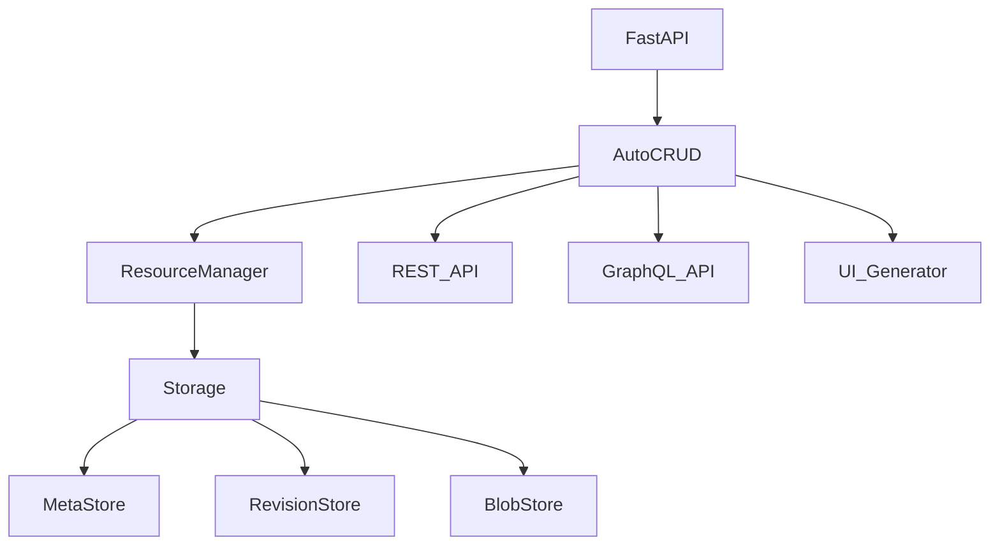

# AutoCRUD

**Model-driven backend platform for FastAPI**

AutoCRUD automatically generates **REST APIs, GraphQL APIs, search, version history, and admin UI** from Python models.

Focus on **business logic**, not infrastructure.

⭐ If you find this project useful, consider giving it a star.

---

# Why AutoCRUD

Modern backend development repeatedly rebuilds the same infrastructure:

- CRUD APIs
- validation
- search and filtering
- version history
- permissions
- background jobs
- admin tools

Most of this code is **not business logic**.

AutoCRUD eliminates this repetition by using a **model-driven architecture**.

Define your model once, and the framework generates the rest.

---

# Example

Define a resource model:

```python
from msgspec import Struct

class User(Struct):
    name: str
    email: str
```

Register the model:

```python
from fastapi import FastAPI
from autocrud import crud

app = FastAPI()

crud.add_model(User)
crud.apply(app)
```

Start the server:

```bash
uvicorn main:app
```

You now automatically get:

```
POST   /users
GET    /users
GET    /users/{id}
PUT    /users/{id}
PATCH  /users/{id}
DELETE /users/{id}
```

OpenAPI documentation is generated automatically.

---

# Architecture



---

# Core Features

## Model-driven APIs

AutoCRUD generates APIs directly from Python models.

```
Model
  ↓
REST API
GraphQL API
OpenAPI
```

---

## Versioned resources

Every resource maintains immutable revision history.

```
Resource
 ├── r1
 ├── r2
 └── r3
```

Advantages:

* audit history
* rollback
* draft workflows
* debugging

---

## Built-in search

Search operates on indexed metadata instead of scanning full resource payloads.

```
QueryBuilder
   ↓
ResourceManager.search()
   ↓
MetaStore.search()
```

---

## Background jobs

Jobs are modeled as resources.

```
create()
  ↓
message_queue.put(resource_id)
```

Workers process jobs through:

```
ResourceManager.start_consume()
```

---

## Storage abstraction

AutoCRUD supports multiple storage backends.

| Backend  | Meta       | Revision | Blob       |
| -------- | ---------- | -------- | ---------- |
| Memory   | memory     | memory   | memory     |
| Disk     | SQLite     | files    | filesystem |
| S3       | SQLite     | S3       | S3         |
| Postgres | PostgreSQL | S3       | S3         |

You can also implement custom storage systems.

---

## UI generation

AutoCRUD can generate a web interface directly from the API.

```
API
 ↓
UI generator
 ↓
admin dashboard
```

This allows rapid creation of internal tools.

---

# Comparison

| Feature         | AutoCRUD  | Hasura     | Django     |
| --------------- | --------- | ---------- | ---------- |
| REST API        | ✅         | ❌          | ✅          |
| GraphQL         | ✅         | ✅          | ⚠️         |
| Version history | ✅         | ❌          | ❌          |
| Search engine   | ✅         | SQL        | ORM        |
| Storage         | pluggable | PostgreSQL | relational |
| Background jobs | built-in  | external   | external   |
| UI generation   | ✅         | console    | admin      |

---

# Quickstart

Install:

```bash
pip install autocrud
```

Run your app:

```bash
uvicorn main:app
```

Open:

```
http://localhost:8000/docs
```

---

# Documentation

Full documentation:

[https://hychou0515.github.io/autocrud/](https://hychou0515.github.io/autocrud/)

---

# Example use cases

AutoCRUD works well for:

* internal tools
* content systems
* configuration management
* job processing systems
* administrative APIs
* workflow management systems

---

# License

MIT
