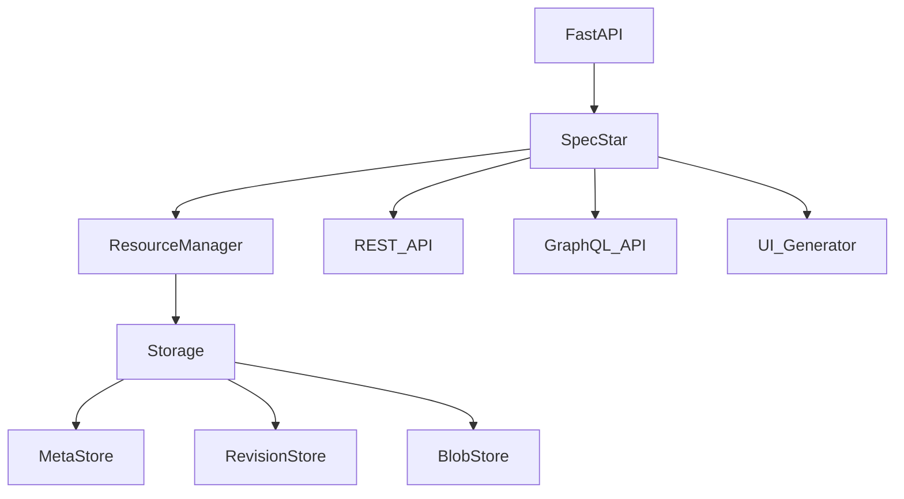

<p align="center">
  
</p>

<p align="center">
  <strong>Spec-driven backend platform for FastAPI</strong><br>
  Generate REST APIs, GraphQL, search, version history, and an admin UI from a single Python model.
</p>

<p align="center">
  <a href="https://pypi.org/project/specstar/"></a>
  <a href="https://github.com/HYChou0515/specstar/blob/master/LICENSE"></a>
  <a href="https://hychou0515.github.io/specstar/"></a>
  <a href="https://codecov.io/gh/HYChou0515/specstar"></a>
</p>

> **Renamed from `autocrud` to `specstar` (v0.10.0).** The old name still installs as a deprecation shim that redirects every `autocrud[.X]` import to `specstar[.X]`. New projects should `pip install specstar`. See the [migration guide](MIGRATION.md).

> **v0.11 adds spec-driven authoring** (additive, zero breaking changes). Edit a single `spec.md` in prose; a Claude Code skill or the `specstar gen` CLI translates it into the declarative Python the engine consumes. See the [Spec-Driven Authoring guide](docs/en/guides/spec-driven.md) and the [v0.11 upgrade notes](docs/en/guides/upgrade-0.11.md).

Focus on **business logic**, not infrastructure.

⭐ If you find this project useful, consider giving it a star.

---

# Why SpecStar

Modern backend development repeatedly rebuilds the same infrastructure:

- CRUD APIs
- validation
- search and filtering
- version history
- permissions
- background jobs
- admin tools

Most of this code is **not business logic**.

SpecStar eliminates this repetition by using a **spec-driven architecture**.

Define your model once, and the framework generates the rest.

## What sets SpecStar apart

Most "model → API" generators stop at routes. SpecStar treats every resource as a **versioned timeline by default**: updates create revisions, history stays queryable, and rollback is built in. Don't need history? Ignore it — the same routes work as plain CRUD.

---

# Example

Define a resource model:

```python
from msgspec import Struct

class User(Struct):
    name: str
    email: str
```

Register the model:

```python continuation
from fastapi import FastAPI
from specstar import spec

app = FastAPI()

spec.add_model(User)
spec.apply(app)
```

> `spec.add_model(User)` is shorthand for `spec.add_model(Schema(User))` — the
> canonical form once you start tracking schema versions or migrations is
> `spec.add_model(Schema(User, "v1"))`, which the quickstart docs use.
> Both run; pick whichever fits your stage.

Start the server:

```bash
uvicorn main:app
```

Optional startup tuning:

```bash
export SPECSTAR_DEFAULT_QUERY_LIMIT=1000
```

This controls the default page size for **list endpoints** (`GET /{model}` and
search routes). The built-in fallback is `2**32 - 1` (effectively unlimited)
— pick a sane value for production. Per-request `limit` and `offset` query
params still override it.

You now automatically get:

```
POST   /user
GET    /user
GET    /user/{resource_id}
PUT    /user/{resource_id}
PATCH  /user/{resource_id}
DELETE /user/{resource_id}
```

The path segment follows `model_naming` (default: kebab-case of the model name,
e.g. `User` -> `/user`). `PUT` replaces the whole resource; `PATCH` expects a
JSON Patch (RFC 6902) array of operations rather than a partial object.

OpenAPI documentation is generated automatically.

---

# Architecture


```mermaid
graph TD

FastAPI --> SpecStar
SpecStar --> ResourceManager
ResourceManager --> Storage

Storage --> MetaStore
Storage --> RevisionStore
Storage --> BlobStore

SpecStar --> REST_API
SpecStar --> GraphQL_API
SpecStar --> UI_Generator
```

---

# Core Features

## Spec-driven APIs

SpecStar generates APIs directly from Python models.

```
Model
  ↓
REST API
GraphQL API   (opt-in: pip install specstar[graphql] + add_route_template(GraphQLRouteTemplate()))
OpenAPI
```

> REST and OpenAPI are wired up automatically when you call `spec.apply(app)`.
> GraphQL is **opt-in**: install the extra (`pip install specstar[graphql]`)
> and register the template explicitly:
>
> ```python
> from specstar import spec
> from specstar.crud.route_templates.graphql import GraphQLRouteTemplate
>
> spec.add_route_template(GraphQLRouteTemplate())
> ```

---

## Versioned resources

Every resource maintains immutable revision history.

```
Resource
 ├── r1
 ├── r2
 └── r3
```

Advantages:

* audit history
* rollback
* draft workflows
* debugging

---

## Built-in search

Search operates on indexed metadata instead of scanning full resource payloads.

```
QueryBuilder
   ↓
ResourceManager.search()
   ↓
MetaStore.search()
```

---

## Background jobs

Jobs are modeled as resources.

```
create()
  ↓
message_queue.put(resource_id)
```

Workers process jobs through:

```
ResourceManager.start_consume()
```

---

## Storage abstraction

SpecStar supports multiple storage backends.

| Backend  | Meta       | Revision | Blob       |
| -------- | ---------- | -------- | ---------- |
| Memory   | memory     | memory   | memory     |
| Disk     | SQLite     | files    | filesystem |
| S3       | SQLite     | S3       | S3         |
| Postgres | PostgreSQL | S3       | S3         |

The rows above are **typical profiles**, not the only valid combinations. The
three storage layers (`IMetaStore` / `IResourceStore` / `IBlobStore`) are
independent — for example, a Postgres `resource_store` exists
(`resource_data` table with `data BYTEA`), so you can keep revision payloads
in Postgres instead of S3 if that fits your deployment. You can also implement
custom storage systems.

---

## UI generation

SpecStar can generate a web interface directly from the API.

```
API
 ↓
UI generator
 ↓
admin dashboard
```

This allows rapid creation of internal tools.

---

# Comparison

| Feature         | SpecStar  | Hasura     | Django     |
| --------------- | --------- | ---------- | ---------- |
| REST API        | ✅         | ❌          | ✅          |
| GraphQL         | ✅         | ✅          | ⚠️         |
| Version history | ✅         | ❌          | ❌          |
| Search engine   | ✅         | SQL        | ORM        |
| Storage         | pluggable | PostgreSQL | relational |
| Background jobs | built-in  | external   | external   |
| UI generation   | ✅         | console    | admin      |

---

# Quickstart

Install:

```bash
pip install specstar
```

**Spec-driven (v0.11+)** — bootstrap a starter project, then describe resources in prose:

```bash
specstar init my_app
# edit spec.md, then in Claude Code:
/specstar regen
# CI-friendly drift check (no LLM):
specstar verify
```

See the [Spec-Driven Authoring guide](docs/en/guides/spec-driven.md) for the full workflow.

**Classic Python** — register models directly:

Run your app:

```bash
uvicorn main:app
```

Open:

```
http://localhost:8000/docs
```

---

# Documentation

Full documentation:

[https://hychou0515.github.io/specstar/](https://hychou0515.github.io/specstar/)

---

# Example use cases

SpecStar works well for:

* internal tools
* content systems
* configuration management
* job processing systems
* administrative APIs
* workflow management systems

---

# License

MIT
