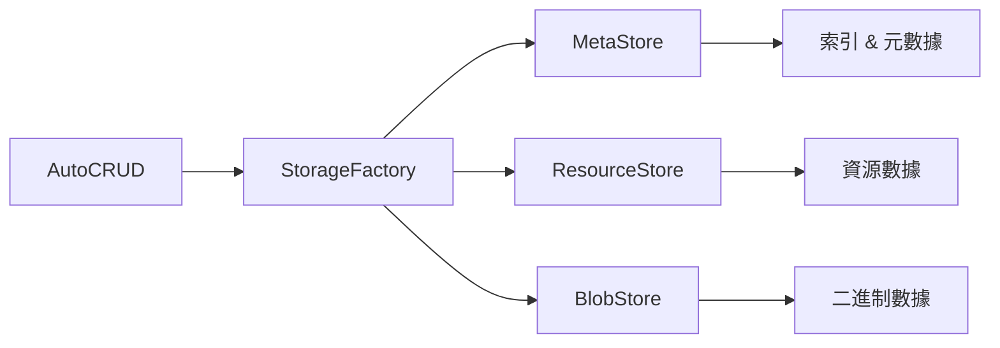

# 儲存設定

AutoCRUD 提供靈活的儲存架構，讓您可以根據需求選擇不同的儲存後端。

## 儲存架構

AutoCRUD 使用分層的儲存架構，將資料分為三個部分：



### 儲存組件

| 組件 | 用途 | 儲存內容 |
|------|------|----------|
| **MetaStore** | 元數據與索引 | 資源 ID、版本資訊、索引欄位、建立/更新時間等 |
| **ResourceStore** | 資源數據 | 實際的資源內容（JSON/MessagePack） |
| **BlobStore** | 二進制數據 | 圖片、檔案等大型二進制數據 |

## 預設配置

如果不指定 `storage_factory`，AutoCRUD 使用記憶體儲存：

```python
from autocrud import AutoCRUD

# 預設使用記憶體儲存
crud = AutoCRUD()
```

**注意**：資料只存在於記憶體中，程序結束後會消失。適合開發測試，不適合生產環境。

## 儲存選項

### 1. 記憶體儲存

適用場景：開發測試、快速原型

```python
from autocrud.resource_manager.storage_factory import MemoryStorageFactory

crud = AutoCRUD(storage_factory=MemoryStorageFactory())
```

**特性**：
- 讀寫速度最快
- 零配置
- 資料不持久化
- 受限於可用記憶體

### 2. 磁碟儲存

適用場景：小型應用、單機部署

```python
from autocrud.resource_manager.storage_factory import DiskStorageFactory

crud = AutoCRUD(
    storage_factory=DiskStorageFactory(rootdir="./data")
)
```

**特性**：
- 資料持久化
- 簡單易用
- 支援完整的索引和搜尋
- 難以擴展到多台伺服器

**目錄結構**：
```
./data/
├── user/
│   ├── meta.db      # SQLite metadata
│   └── resources/   # 資源數據
└── product/
    ├── meta.db
    └── resources/
```

### 3. S3 + SQLite

適用場景：中型應用、多實例部署

```python
import os
from autocrud.resource_manager.storage_factory import S3StorageFactory

crud = AutoCRUD(
    storage_factory=S3StorageFactory(
        bucket=os.getenv("S3_BUCKET", "my-bucket"),
        endpoint_url=os.getenv("S3_ENDPOINT_URL", "http://localhost:9000"),
        access_key_id=os.getenv("AWS_ACCESS_KEY_ID", "minioadmin"),
        secret_access_key=os.getenv("AWS_SECRET_ACCESS_KEY", "minioadmin"),
        region_name=os.getenv("AWS_REGION", "us-east-1"),
        prefix="my-app/",
    )
)
```

**特性**：
- SQLite 資料庫存於 S3，支援 ETag-based 樂觀鎖定
- 資源數據和二進制檔案存於 S3
- 支援多實例部署
- 網路延遲較本地儲存高

📖 [S3 Backend 完整指南](s3-backend.md)

### 4. PostgreSQL + S3

適用場景：大型應用、需要複雜查詢與高可用性

```python
import os
from autocrud.resource_manager.storage_factory import PostgreSQLStorageFactory

crud = AutoCRUD(
    storage_factory=PostgreSQLStorageFactory(
        connection_string=os.getenv("DATABASE_URL"),
        s3_bucket=os.getenv("S3_BUCKET"),
        s3_endpoint_url=os.getenv("S3_ENDPOINT_URL"),
        s3_region=os.getenv("AWS_REGION", "us-east-1"),
    )
)
```

**特性**：
- PostgreSQL 存放元數據，支援複雜索引和快速查詢
- S3 存放資源數據和二進制檔案
- 強大的查詢能力
- 高可用性、易於備份

📖 [PostgreSQL + S3 Backend 設定](postgres-s3-backend.md)

## 儲存後端比較

| 特性 | 記憶體 | 磁碟 | S3 + SQLite | PostgreSQL + S3 |
|------|--------|------|-------------|-----------------|
| **持久化** | ✗ | ✓ | ✓ | ✓ |
| **多實例** | ✗ | ✗ | ✓ | ✓ |
| **擴展性** | 低 | 中 | 高 | 極高 |
| **查詢能力** | 中 | 中 | 中 | 強 |
| **配置難度** | 極低 | 低 | 中 | 高 |
| **適用場景** | 開發測試 | 小型應用 | 中型應用 | 大型應用 |

## 混用不同儲存

不同模型可以使用不同的儲存後端：

```python
from autocrud import AutoCRUD
from autocrud.resource_manager.storage_factory import (
    DiskStorageFactory,
    MemoryStorageFactory,
    PostgreSQLStorageFactory,
)

crud = AutoCRUD()

# User：PostgreSQL + S3（重要資料，需要複雜查詢）
crud.add_model(
    User,
    storage_factory=PostgreSQLStorageFactory(...)
)

# Article：磁碟儲存（需要持久化）
crud.add_model(
    Article,
    storage_factory=DiskStorageFactory(rootdir="./data/articles")
)

# Session：記憶體（臨時資料）
crud.add_model(Session)  # 使用預設記憶體儲存
```

## 索引欄位設定

所有儲存後端都需要設定索引欄位來支援搜尋：

```python
from msgspec import Struct

class User(Struct):
    name: str
    email: str
    age: int
    city: str

crud.add_model(
    User,
    indexed_fields=[
        ("age", int),      # 可搜尋年齡
        ("city", str),     # 可搜尋城市
        ("email", str),    # 可搜尋 email
    ]
)
```

**建議**：
- 只索引需要搜尋的欄位
- 常用的過濾條件應該建立索引
- 避免索引所有欄位（影響寫入效能）

## 環境配置範例

### 開發環境

```python
# 使用記憶體儲存，快速啟動
crud = AutoCRUD()
```

### 小型生產環境

```python
from autocrud.resource_manager.storage_factory import DiskStorageFactory

crud = AutoCRUD(
    storage_factory=DiskStorageFactory(rootdir="./data")
)
```

### 中型應用

```python
import os
from autocrud.resource_manager.storage_factory import S3StorageFactory

crud = AutoCRUD(
    storage_factory=S3StorageFactory(
        bucket=os.getenv("S3_BUCKET"),
        endpoint_url=os.getenv("S3_ENDPOINT_URL"),
        region_name=os.getenv("AWS_REGION", "us-east-1"),
    )
)
```

### 大型應用

```python
import os
from autocrud.resource_manager.storage_factory import PostgreSQLStorageFactory

crud = AutoCRUD(
    storage_factory=PostgreSQLStorageFactory(
        connection_string=os.getenv("DATABASE_URL"),
        s3_bucket=os.getenv("S3_BUCKET"),
        s3_endpoint_url=os.getenv("S3_ENDPOINT_URL"),
        s3_region=os.getenv("AWS_REGION", "us-east-1"),
    )
)
```

## 資料格式

預設使用 JSON 格式儲存資料，也可以設定為 MessagePack：

```python
from autocrud.resource_manager.basic import Encoding
from autocrud.resource_manager.storage_factory import DiskStorageFactory

storage_factory = DiskStorageFactory(
    rootdir="./data",
    encoding=Encoding.msgpack  # 更好的效能和更小的檔案
)
```

## 常見問題

**Q: 可以在運行時切換儲存後端嗎？**

A: 不建議。儲存後端應該在應用啟動時設定，並在整個生命週期內保持不變。

**Q: 如何備份資料？**

A: 
- **磁碟儲存**：直接複製整個資料目錄
- **S3 儲存**：使用 S3 的備份功能
- **PostgreSQL**：使用 pg_dump 或資料庫備份工具

**Q: Memory Storage 適合生產環境嗎？**

A: 不適合。Memory Storage 僅適合開發測試環境，生產環境應使用持久化儲存。

## 進階主題

- **[S3 Backend 完整指南](s3-backend.md)** - S3 儲存的詳細配置與最佳實踐
- **[PostgreSQL + S3 Backend 設定](postgres-s3-backend.md)** - PostgreSQL + S3的詳細配置與最佳實踐

## 💡 常見問題

### Q: 如何在開發和生產環境使用不同的儲存？

```python
import os
from autocrud import AutoCRUD
from autocrud.resource_manager.storage_factory import (
    DiskStorageFactory,
    S3StorageFactory,
)

if os.getenv("ENV") == "production":
    storage_factory = S3StorageFactory(
        bucket=os.getenv("S3_BUCKET"),
        region_name=os.getenv("AWS_REGION"),
    )
else:
    storage_factory = DiskStorageFactory(rootdir="./dev-data")

crud = AutoCRUD(storage_factory=storage_factory)
```

### Q: 可以混用不同的儲存後端嗎？

可以！不同模型可以使用不同的儲存：

```python
# User 使用 PostgreSQL + S3
user_storage = PostgreSQLStorageFactory(...)
crud.add_model(User, storage_factory=user_storage)

# Product 使用 S3 + SQLite
product_storage = S3StorageFactory(...)
crud.add_model(Product, storage_factory=product_storage)

# TempData 使用記憶體
crud.add_model(TempData)  # 使用預設記憶體儲存
```


## 下一步

<div class="grid cards" markdown>

-   :material-database-cog: __了解儲存架構__

    ---

    深入了解 AutoCRUD 的混合儲存架構設計

    [:octicons-arrow-right-24: 架構概覽](../core-concepts/architecture.md)


-   :material-database-cog: __儲存後端效能比較__

    ---

    比較不同儲存後端的效能表現

    [:octicons-arrow-right-24: 儲存後端效能比較](../benchmarks/index.md)

</div>
