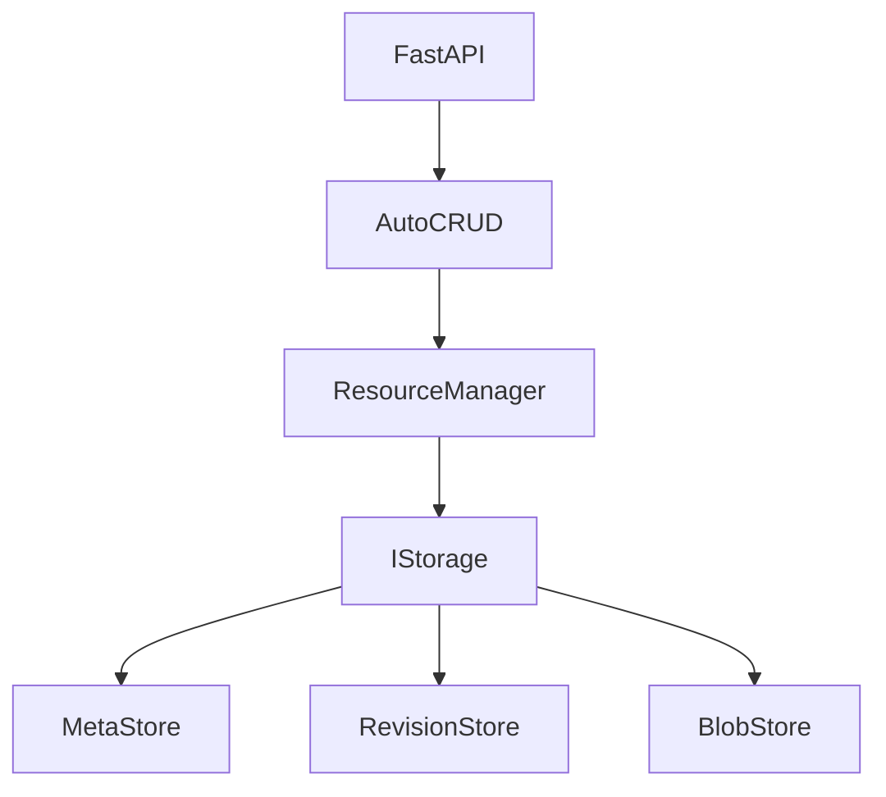

# Architecture

AutoCRUD is designed as a **model-driven API framework** built on top of FastAPI.

Instead of manually implementing storage, search, versioning, and routing logic,
AutoCRUD provides a unified architecture that automatically generates these capabilities
from your domain models.

At the center of this architecture is the **ResourceManager**.

---

# High-level architecture

The overall architecture looks like this:





Each layer has a clear responsibility.

| Layer | Responsibility |
|---|---|
| FastAPI | HTTP routing and request handling |
| AutoCRUD | resource registration and route generation |
| ResourceManager | business operations on resources |
| IStorage | persistence abstraction |
| MetaStore | metadata and search |
| RevisionStore | immutable revision storage |
| BlobStore | binary file storage |

---

# Core principle: ResourceManager is the single interface

A key design rule of AutoCRUD is:

> Developers should only interact with resources through the **ResourceManager**.

Developers never directly access:

- SQL databases
- S3 storage
- file systems

All resource operations go through the manager.

Example:

```python
info = resource_manager.create(data)
resource = resource_manager.get(resource_id)
resource_manager.update(resource_id, new_data)
```

The manager ensures:

* validation
* metadata updates
* revision creation
* event hooks
* message queue integration

This keeps application logic consistent.

---

# Resource model

AutoCRUD treats application data as **versioned resources**.

A resource consists of:

```
Resource
 ├── ResourceMeta
 └── Revisions
       ├── r1
       ├── r2
       └── r3
```

Each revision contains the **complete state** of the resource.

The active revision is stored in metadata.

```
ResourceMeta
 ├── resource_id
 └── current_revision_id
```

Switching revisions simply updates this pointer.

---

# Metadata layer

Metadata describes a resource without storing the full data payload.

Example metadata:

```
ResourceMeta
 ├── resource_id
 ├── current_revision_id
 ├── created_time
 ├── updated_time
 ├── created_by
 ├── updated_by
 ├── total_revision_count
 └── indexed_data
```

The metadata layer enables:

* fast search
* pagination
* filtering
* sorting

without loading revision data.

---

# Revision storage

Revision data is stored as **encoded binary payloads**.

Example:

```
revision_store
   ├── resource_id_1
   │      ├── r1
   │      └── r2
   └── resource_id_2
          └── r1
```

Properties of revisions:

* immutable
* append-only
* full snapshot of resource state

Updating a resource creates a new revision.

```
r1 → r2 → r3
```

Older revisions remain unchanged.

---

# Search architecture

AutoCRUD avoids scanning full resource payloads.

Instead, searchable fields are extracted into metadata.

Example:

```
indexed_data = {
    "user.email": "alice@example.com",
    "user.name": "Alice"
}
```

Search flow:

```
QueryBuilder
   │
   ▼
ResourceManager.search()
   │
   ▼
MetaStore.search()
```

Only metadata is scanned.

This keeps queries fast even when revision payloads are large.

---

# Storage abstraction

AutoCRUD abstracts persistence using `IStorage`.

```
IStorage
 ├── meta operations
 ├── revision operations
 └── export/import
```

Different storage backends implement this interface.

Examples:

| Backend  | Meta       | Revision   | Blob       |
| -------- | ---------- | ---------- | ---------- |
| Memory   | memory     | memory     | memory     |
| Disk     | SQLite     | filesystem | filesystem |
| S3       | SQLite     | S3         | S3         |
| Postgres | PostgreSQL | S3         | S3         |

Because storage is abstracted, application code never changes.

---

# Route generation

AutoCRUD generates API routes automatically using **route templates**.

```
RouteTemplate
   │
   ▼
apply(model, resource_manager, router)
```

Examples of generated routes:

```
POST   /users
GET    /users
GET    /users/{id}
PUT    /users/{id}
PATCH  /users/{id}
DELETE /users/{id}
```

Route templates allow customization while maintaining consistent API behavior.

---

# Message queue integration

Resources can optionally integrate with message queues.

When a resource has a message queue configured:

```
create()
   │
   ▼
message_queue.put(resource_id)
```

Workers consume jobs via:

```
ResourceManager.start_consume()
```

This allows background jobs to use the same resource model.

Each job can optionally set `max_retries` to override the queue-level default.
When `max_retries` is `None`, the queue configuration is used.

---

# Event handlers

AutoCRUD supports event handlers that run during resource operations.

Examples:

* reference integrity checks
* validation hooks
* cross-resource updates

Event handlers are attached to resource managers and executed automatically.

---

# Why this architecture

This architecture aims to achieve several goals:

| Goal                           | Solution              |
| ------------------------------ | --------------------- |
| eliminate repetitive CRUD code | model-driven APIs     |
| support version history        | immutable revisions   |
| enable efficient search        | metadata indexing     |
| allow multiple storage systems | storage abstraction   |
| integrate background jobs      | message queue support |

The result is a framework where developers define their **domain model**
and the infrastructure is generated automatically.

---

# Summary

The AutoCRUD architecture centers on a simple idea:

> Application data should be managed as versioned resources.

By combining:

* ResourceManager
* metadata indexing
* immutable revisions
* storage abstraction
* automatic route generation

AutoCRUD reduces infrastructure complexity and allows developers to focus on business logic.

