# 🏗️ What is AutoCRUD

AutoCRUD’s core design philosophy is **“Schema as Infrastructure.”** Developers only need to define a data model (Schema), and the system automatically builds a complete backend infrastructure—including API routes, the Service Layer, Permission Control, and the underlying Storage Mechanism.

To achieve this, AutoCRUD adopts a **Layered Architecture**, decoupling the HTTP interface, business logic, and data persistence.

## Overview

The overall architecture is composed of four layers. The diagram below shows the interaction between **AutoCRUD system components (blue/green lines)** and the **developer-defined boundary (purple dashed lines/labels)**. In particular, developers orchestrate and initialize these three layers through the `AutoCRUD` Interface:

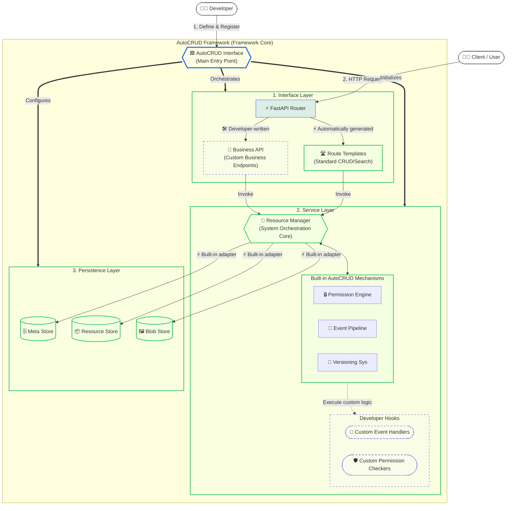
```mermaid
flowchart TD
    Dev([👨‍💻 Developer]) --> |"1. Define & Register"| AC{{"🟦 AutoCRUD Interface<br/>(Main Entry Point)"}}
    Client([🧑‍💻 Client / User]) --> |"2. HTTP Request"| API[⚡ FastAPI Router]

    subgraph Framework ["AutoCRUD Framework (Framework Core)"]
        direction TB
        
        AC ==> |"Orchestrates"| Interface
        AC ==> |"Initializes"| Service
        AC ==> |"Configures"| Persistence

        subgraph Interface ["1. Interface Layer"]
            direction TB
            API --> |"⚡ Automatically generated"| Templates["🛣️ Route Templates<br/>(Standard CRUD/Search)"]
            API --> |"🛠️ Developer-written"| BizAPI["🧩 Business API<br/>(Custom Business Endpoints)"]
        end

        subgraph Service ["2. Service Layer"]
            direction TB
            Templates & BizAPI --> |"Invoke"| RM{{"🧠 Resource Manager<br/>(System Orchestration Core)"}}
            
            subgraph Logic ["Built-in AutoCRUD Mechanisms"]
                direction LR
                Perm["🔒 Permission Engine"]
                Event["🔔 Event Pipeline"]
                Ver["📜 Versioning Sys"]
            end
            
            RM <--> Logic
            
            subgraph CustomHandlers ["Developer Hooks"]
                direction LR
                CH(["🧩 Custom Event Handlers"])
                CP(["🛡️ Custom Permission Checkers"])
            end
            
            Logic -.-> |"Execute custom logic"| CustomHandlers
        end

        subgraph Persistence ["3. Persistence Layer"]
            direction LR
            RM --> |"⚡ Built-in adapter"| MetaStore[("🗄️ Meta Store")]
            RM --> |"⚡ Built-in adapter"| ResStore[("📦 Resource Store")]
            RM --> |"⚡ Built-in adapter"| BlobStore[("🖼️ Blob Store")]
        end
    end

    %% Styling
    classDef sys fill:#dcfce730,stroke:#22c55e,stroke-width:2px;
    classDef user fill:#f5f3ff30,stroke:#7c3aed,stroke-dasharray: 5 5;
    classDef bridge fill:#eff6ff30,stroke:#2563eb,stroke-width:3px;
    
    class Interface,Service,Persistence,RM,Logic,Templates,MetaStore,ResStore,BlobStore sys;
    class BizAPI,CustomHandlers,CH,CP user;
    class AC bridge;

    style Dev fill:#f9f9f930,stroke:#333
    style Client fill:#f9f9f930,stroke:#333
    style API fill:#60a5fa30,stroke:#2563eb
```

### System Boundaries: What You Own vs. What the System Provides

To help developers get up to speed faster, AutoCRUD clearly delineates responsibilities:

| Layer | 📦 AutoCRUD Provides (Built-in) | 🧑‍💻 You Provide (User-defined) |
| :--- | :--- | :--- |
| **Infrastructure** | Hybrid Storage adapters (SQL, S3, FS), Data Encoding/Decoding (msgspec), Deduplication | Connection Strings |
| **Routing** | RESTful CRUD/Search route templates, GraphQL auto-generation | **Resource Schema**, Custom Endpoints |
| **Service** | Permission Validation Framework (RBAC/ACL), Revision Chain tracking, Event Broadcaster, Migration Orchestration | **Business Hooks (Event Handlers)**, custom Permission Logic |
| **Operations** | Automated audit log scripts, multi-version coexistence support, Partial Patch validation | Data converters (Data Converters) |

---

--8<-- "en/includes/functions.md"

## Why AutoCRUD?

While SQLAlchemy or Django ORM dominate the Python ecosystem, AutoCRUD takes a different architectural path to address the pain points of traditional ORMs in large-scale applications.

| Feature | Traditional ORM (SQLAlchemy / Django) | AutoCRUD |
| :--- | :--- | :--- |
| **Design Core** | **Table-First**: Object mapping of database tables | **Resource-First**: Lifecycle management for business resources |
| **Cost to add a resource** | **Extremely high**: define DB tables, write migrations, develop CRUD services, create DTOs (Pydantic/Marshmallow), manually mount API routes, implement permission validation | **Extremely low**: define a single `msgspec.Struct` (Schema) and inject it into AutoCRUD; the system immediately generates complete API routes, a hybrid storage chain, a permission framework, and a versioning mechanism |
| **Query mindset** | **SQL-Oriented**: must deal with complex joins and table relationships; hard to fully escape SQL thinking | **Pythonic**: filter fields via Partial Read to avoid join complexity and focus on consolidating business logic |
| **Relationships** | **Foreign Key**: rely on database constraints and cascade | **Event-Driven**: no implicit foreign keys; relationship behavior is controlled explicitly by Event Handlers |
| **Versioning** | Requires plugins or custom implementation | **Native**: built-in Revision History and Draft/Stable state machine |
| **Migration** | **Imperative**: complex Alembic upgrade/downgrade scripts | **Functional**: provides pure `Data -> Data` converters and supports Lazy Migration |
| **Storage architecture** | Single relational database | **Hybrid**: Meta (SQL/Redis) + Payload (Object Storage) + separated Blob storage |

### Development Efficiency: From “tedious engineering” to “instant go-live”

In a traditional development workflow, adding a business resource (e.g., “Customer Contract”) often means substantial engineering effort, because you must wire together details across layers. AutoCRUD automates this repetitive work.

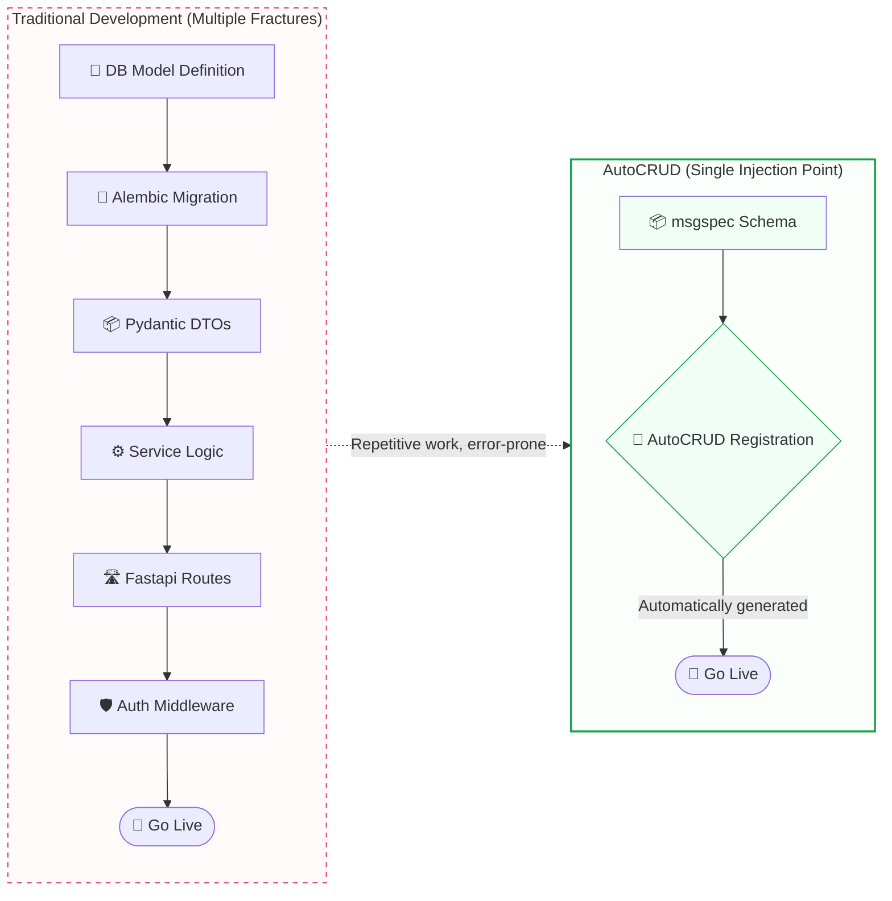
```mermaid
flowchart LR
    subgraph Traditional ["Traditional Development (Multiple Fractures)"]
        direction TB
        T1["📐 DB Model Definition"] --> T2["📑 Alembic Migration"]
        T2 --> T3["📦 Pydantic DTOs"]
        T3 --> T4["⚙️ Service Logic"]
        T4 --> T5["🛣️ Fastapi Routes"]
        T5 --> T6["🛡️ Auth Middleware"]
        T6 --> Finish1(["🚀 Go Live"])
    end

    subgraph AC ["AutoCRUD (Single Injection Point)"]
        direction TB
        S1["📦 msgspec Schema"] --> S2{"🔌 AutoCRUD Registration"}
        S2 --> |"Automatically generated"| Finish2(["🚀 Go Live"])
    end

    Traditional -.-> |"Repetitive work, error-prone"| AC
    
    %% Styling
    style Traditional fill:#fff1f250,stroke:#e11d48,stroke-dasharray: 5 5
    style AC fill:#f0fdf450,stroke:#16a34a,stroke-width:2px
    style S1 fill:#dcfce750
    style S2 fill:#dcfce750,stroke:#16a34a
```

### Pure Python

AutoCRUD helps developers escape the swamp of SQL and DB dialects.

* **No need to learn a Migration DSL**: migration logic is just plain Python functions—take old data as input and return the new structure.
* **Low operational overhead**: since it does not strongly depend on strictly consistent relational database features (such as foreign keys), the underlying storage can be easily swapped for distributed databases or NoSQL solutions, offering stronger horizontal scalability potential.

### Focus on Business Logic: Logic-First over SQL-Heavy

In the traditional ORM world, even the most Pythonic tools (like SQLAlchemy) still force developers to spend significant effort thinking about “how to join” and “whether foreign key fields match.” This scatters business logic across relationships among multiple tables, increasing maintenance complexity.

AutoCRUD embraces a different philosophy:

* **Highly consolidated logic**: it encourages co-locating all data needed by a resource within the Schema, rather than fragmenting it.
* **Reduce load via Partial Read**: worried about an overly wide table creating a payload that’s too large? With AutoCRUD’s built-in `Partial Read`, you can precisely filter out fields you don’t need for this request during decoding.
* **Focus on “what,” not “how”**: developers no longer need to think about SQL syntax or join keys, and can devote 100% of their energy to business logic and the resource lifecycle itself.

### No Hidden Side Effects

Traditional ORM `ON DELETE CASCADE` is convenient, but it is often a silent killer of system stability. AutoCRUD adopts a **“make behavior explicit”** strategy: it does not use database-level foreign keys.

* **What you see is what you get**: if deleting A must also delete B, you must explicitly register an `AfterDelete` event.
* **Testability**: all business logic lives in Python code, not hidden inside database schema definitions, making unit tests much easier to cover.

### Virtual NoSQL Engine

AutoCRUD can be seen as a **“Soft NoSQL”** solution.

* **No engine burden**: we don’t reinvent a database engine; instead, we blend mature storage solutions together (RDBMS indexing capability + Object Storage throughput capability).
* **Best-practice encapsulation**: developers gain NoSQL flexibility (schema-free, scale-out) without having to handle sharding or consistency problems themselves, because AutoCRUD has encapsulated this complexity through `ResourceManager`.

### 1. Design Core: Table-First vs. Resource-First

Traditional ORMs often force developers to normalize business objects into multiple database tables, causing business logic to “accommodate” the persistence layer. AutoCRUD instead lets developers focus on defining Schemas, while the system automatically handles the underlying storage mapping.

<table>
<tr>
<td width="50%">

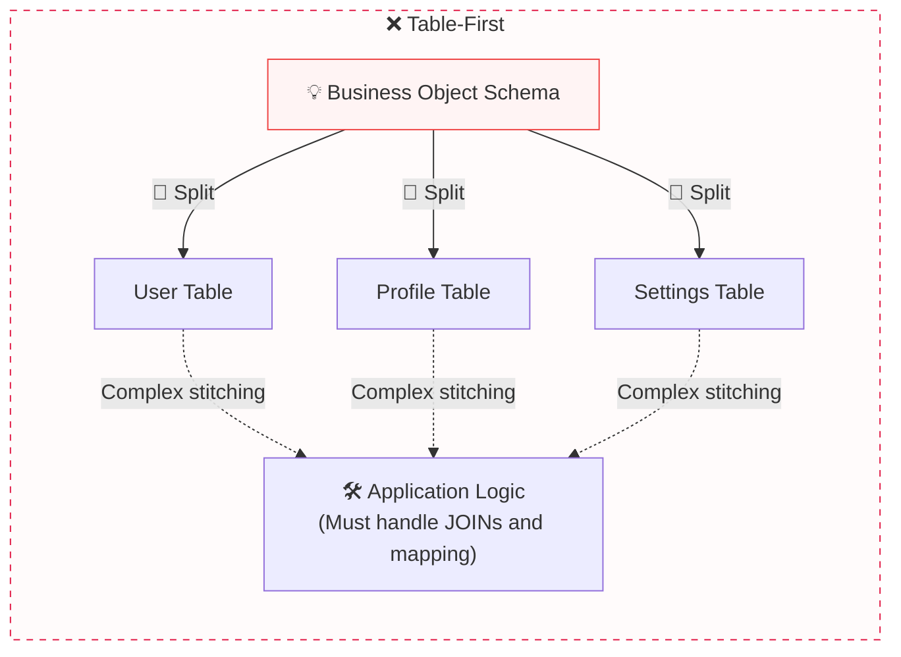
```mermaid
flowchart TD
    subgraph ORM ["❌ Table-First"]
        direction TB
        OBJ["💡 Business Object Schema"]
        OBJ -- "🚫 Split" --> T1[User Table]
        OBJ -- "🚫 Split" --> T2[Profile Table]
        OBJ -- "🚫 Split" --> T3[Settings Table]
        
        T1 & T2 & T3 -.-> |"Complex stitching"| APP["🛠️ Application Logic<br/>(Must handle JOINs and mapping)"]
    end
    
    %% Styling
    style ORM fill:#fff1f250,stroke:#e11d48,stroke-dasharray: 5 5
    style OBJ fill:#fee2e250,stroke:#ef4444
```

</td>
<td width="50%">

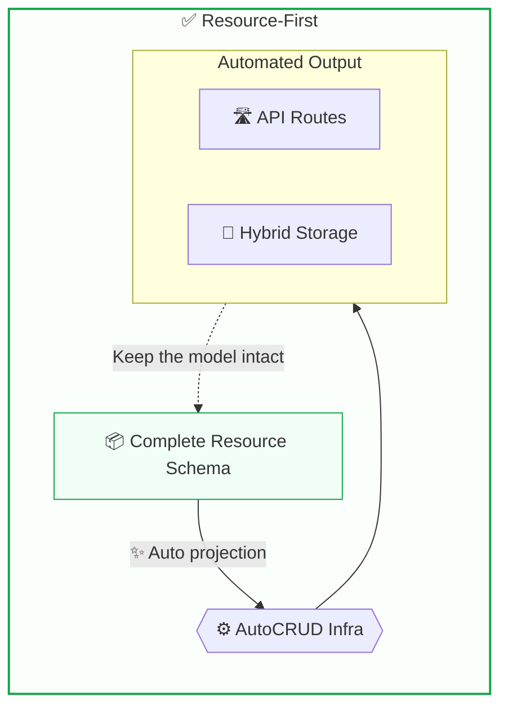
```mermaid
flowchart TD
    subgraph AC ["✅ Resource-First"]
        direction TB
        SCHEMA["📦 Complete Resource Schema"]
        SCHEMA -- "✨ Auto projection" --> INFRA{{"⚙️ AutoCRUD Infra"}}
        
        subgraph Auto [Automated Output]
            API["🛣️ API Routes"]
            STORE["💾 Hybrid Storage"]
        end
        
        INFRA --> Auto
        Auto -.-> |"Keep the model intact"| SCHEMA
    end
    
    %% Styling
    style AC fill:#f0fdf450,stroke:#16a34a,stroke-width:2px
    style SCHEMA fill:#dcfce750,stroke:#16a34a
```

</td>
</tr>
</table>
### 2. Query Paradigm

<table>
<tr>
<td width="50%">

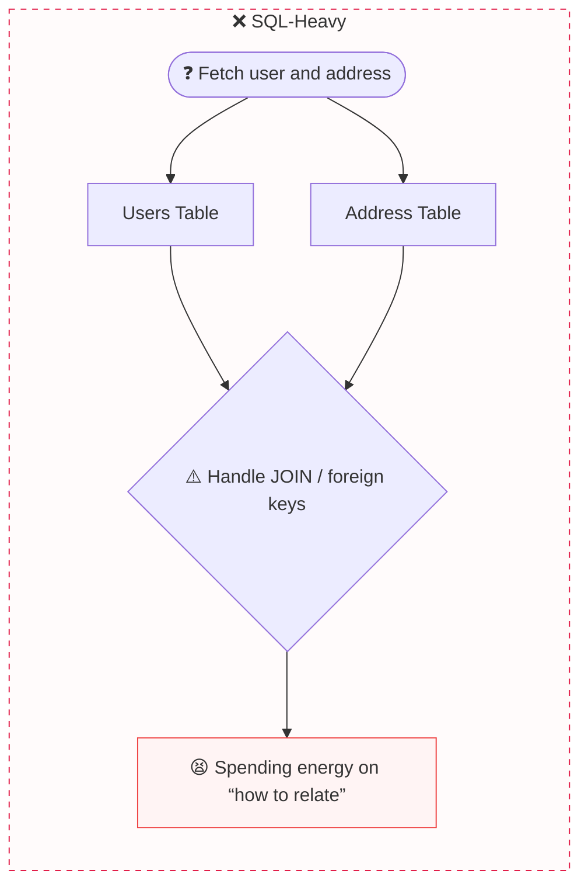
```mermaid
flowchart TD
    subgraph ORM ["❌ SQL-Heavy"]
        direction TB
        Goal(["❓ Fetch user and address"])
        Goal --> T1[Users Table]
        Goal --> T2[Address Table]
        T1 & T2 --> JOIN{"⚠️ Handle JOIN / foreign keys"}
        JOIN --> Logic["😫 Spending energy on “how to relate”"]
    end
    
    %% Styling
    style ORM fill:#fff1f250,stroke:#e11d48,stroke-dasharray: 5 5
    style Logic fill:#fee2e250,stroke:#ef4444
```

</td>
<td width="50%">

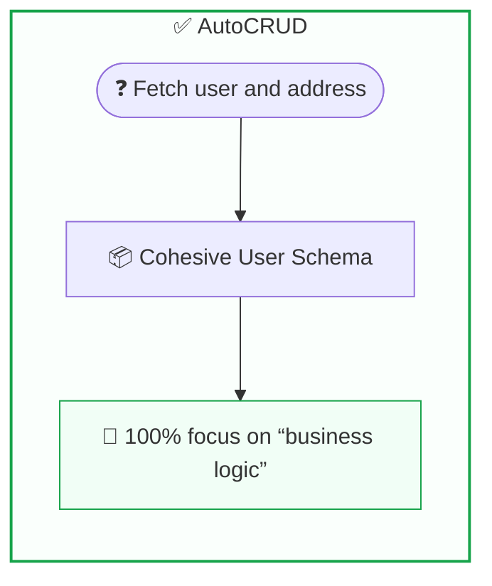
```mermaid
flowchart TD
    subgraph AC ["✅ AutoCRUD"]
        direction TB
        Goal2(["❓ Fetch user and address"])
        Goal2 --> Schema["📦 Cohesive User Schema"]
        Schema --> Logic2["🧠 100% focus on “business logic”"]
    end
    
    %% Styling
    style AC fill:#f0fdf450,stroke:#16a34a,stroke-width:2px
    style Logic2 fill:#dcfce750,stroke:#16a34a
```

</td>
</tr>
</table>

### 3. Logic Control

<table>
<tr>
<td width="50%">

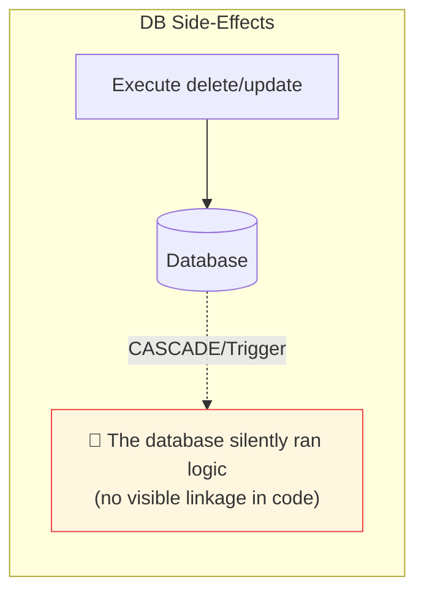
```mermaid
flowchart TD
    subgraph ORM ["DB Side-Effects"]
        direction TB
        Action[Execute delete/update] --> DB[(Database)]
        DB -.-> |"CASCADE/Trigger"| Secret["👀 The database silently ran logic<br/>(no visible linkage in code)"]
        style Secret fill:#fee2e250,stroke:#ef4444
    end
```

</td>
<td width="50%">

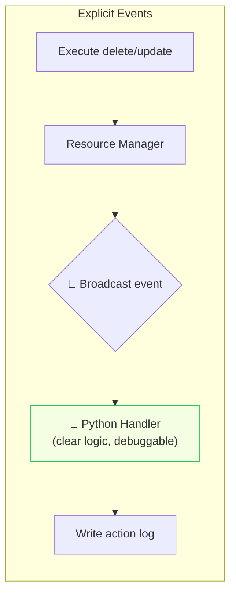
```mermaid
flowchart TD
    subgraph AC ["Explicit Events"]
        direction TB
        Action2[Execute delete/update] --> RM[Resource Manager]
        RM --> Event{📢 Broadcast event}
        Event --> Handler["🧩 Python Handler<br/>(clear logic, debuggable)"]
        Handler --> Log[Write action log]
        style Handler fill:#dcfce750,stroke:#22c55e
    end
```

</td>
</tr>
</table>

### 4. Versioning

<table>
<tr>
<td width="50%">

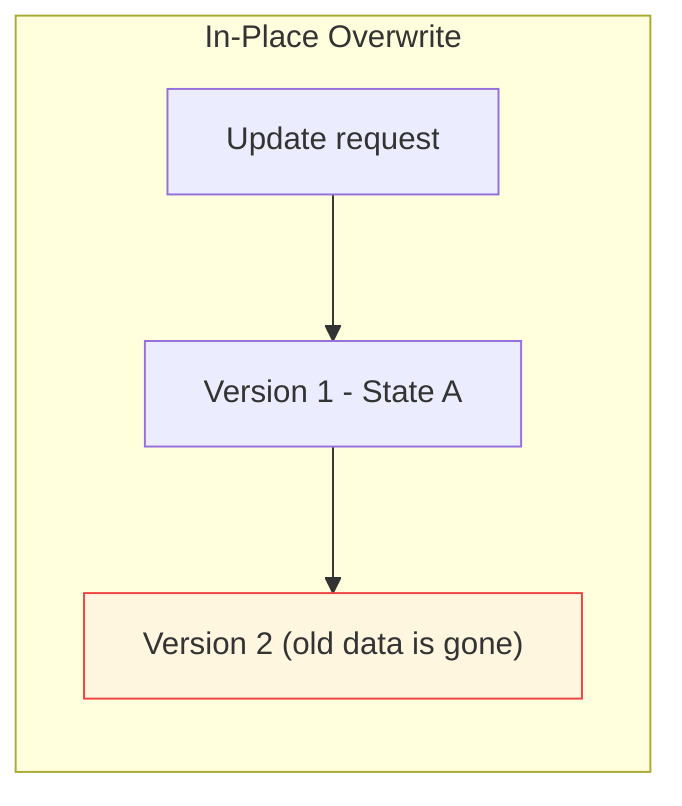
```mermaid
flowchart TD
    subgraph ORM ["In-Place Overwrite"]
        direction TB
        V1[Version 1 - State A]
        Update[Update request] --> V1
        V1 --> V1_NEW["Version 2 (old data is gone)"]
        style V1_NEW fill:#fee2e250,stroke:#ef4444
    end
```

</td>
<td width="50%">

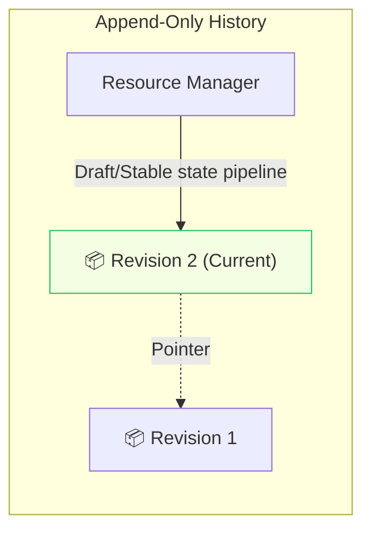
```mermaid
flowchart TD
    subgraph AC ["Append-Only History"]
        direction TB
        H1["📦 Revision 1"]
        H2["📦 Revision 2 (Current)"]
        H2 -.-> |"Pointer"| H1
        RM[Resource Manager] --> |"Draft/Stable state pipeline"| H2
        style H2 fill:#dcfce750,stroke:#22c55e
    end
```

</td>
</tr>
</table>

### 5. Migration

<table>
<tr>
<td width="50%">

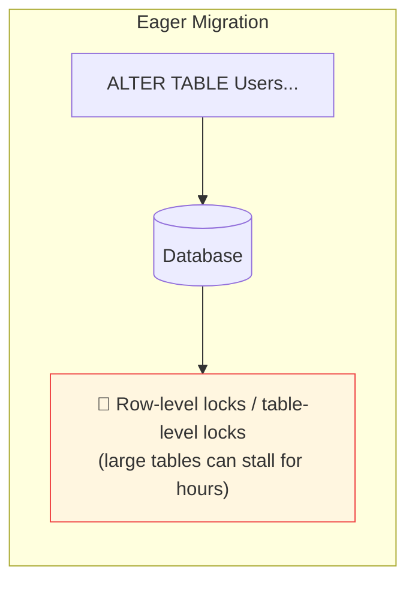
```mermaid
flowchart TD
    subgraph ORM ["Eager Migration"]
        direction TB
        ALTER["ALTER TABLE Users..."]
        ALTER --> DB[(Database)]
        DB --> Lock["🚫 Row-level locks / table-level locks<br/>(large tables can stall for hours)"]
        style Lock fill:#fee2e250,stroke:#ef4444
    end
```

</td>
<td width="50%">

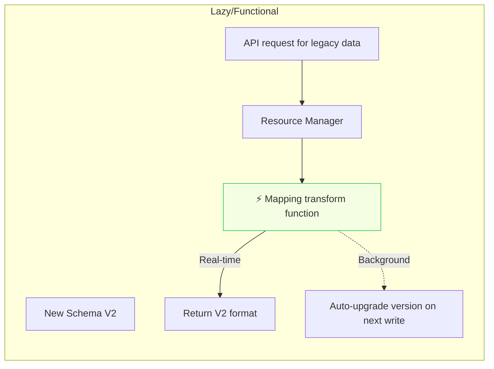
```mermaid
flowchart TD
    subgraph AC ["Lazy/Functional"]
        direction TB
        Schema2[New Schema V2]
        Req[API request for legacy data] --> RM[Resource Manager]
        RM --> Map["⚡ Mapping transform function"]
        Map -->|Real-time| Resp[Return V2 format]
        Map -.-> |Background| STORE["Auto-upgrade version on next write"]
        style Map fill:#dcfce750,stroke:#22c55e
    end
```

</td>
</tr>
</table>

### 6. Storage Architecture

<table>
<tr>
<td width="50%">

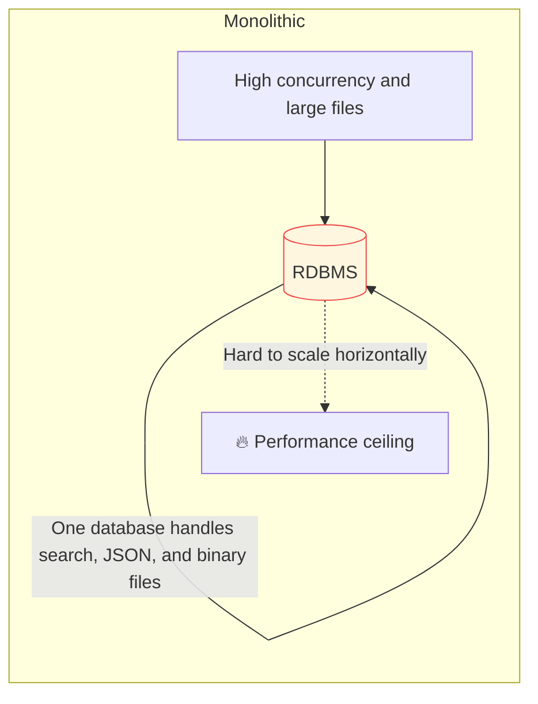
```mermaid
flowchart TD
    subgraph ORM ["Monolithic"]
        direction TB
        REQ[High concurrency and large files] --> DB[(RDBMS)]
        DB --> |"One database handles search, JSON, and binary files"| DB
        DB -.-> |"Hard to scale horizontally"| CRASH[🔥 Performance ceiling]
        style DB fill:#fee2e250,stroke:#ef4444
    end
```

</td>
<td width="50%">

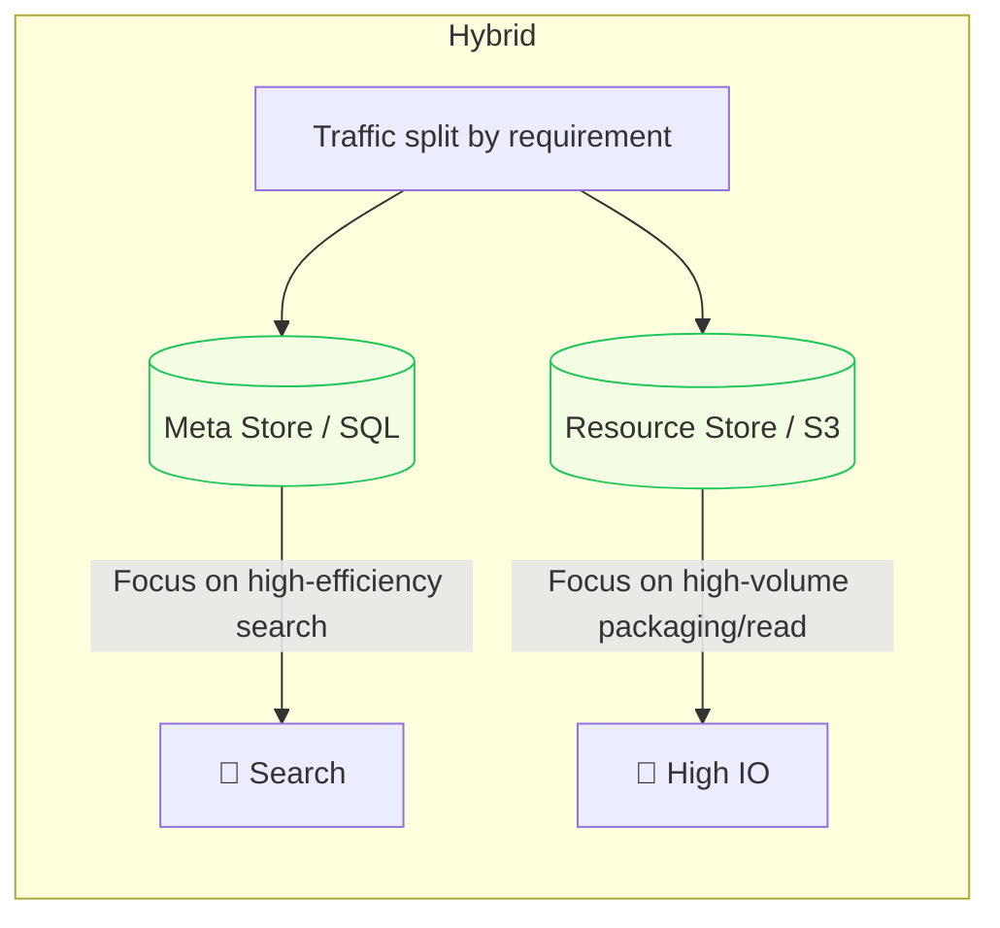
```mermaid
flowchart TD
    subgraph AC ["Hybrid"]
        direction TB
        REQ2[Traffic split by requirement] --> META[(Meta Store / SQL)]
        REQ2 --> DATA[(Resource Store / S3)]
        META --> |"Focus on high-efficiency search"| SEARCH[🔎 Search]
        DATA --> |"Focus on high-volume packaging/read"| IO[🚀 High IO]
        style META fill:#dcfce750,stroke:#22c55e
        style DATA fill:#dcfce750,stroke:#22c55e
    end
```

</td>
</tr>
</table>

## Core Components

### 1. Application Layer: `AutoCRUD`

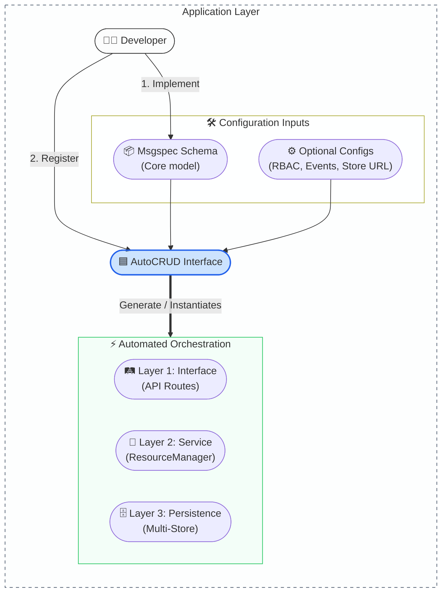
```mermaid
flowchart TD
    subgraph App ["Application Layer"]
        direction TB
        DEV([👨‍💻 Developer])
        
        subgraph Definitions ["🛠️ Configuration Inputs"]
            SCHEMA(["📦 Msgspec Schema<br/>(Core model)"])
            CONFIG(["⚙️ Optional Configs<br/>(RBAC, Events, Store URL)"])
        end
        
        AC_INTF(["🟦 AutoCRUD Interface"])
        
        DEV --> |"1. Implement"| SCHEMA
        DEV --> |"2. Register"| AC_INTF
        SCHEMA & CONFIG --> AC_INTF
        
        subgraph Orchestration ["⚡ Automated Orchestration"]
            direction LR
            L1(["🛤️ Layer 1: Interface<br/>(API Routes)"])
            L2(["🧠 Layer 2: Service<br/>(ResourceManager)"])
            L3(["🗄️ Layer 3: Persistence<br/>(Multi-Store)"])
        end
        
        AC_INTF ==> |"Generate / Instantiates"| Orchestration
    end

    %% Styling
    style AC_INTF fill:#60a5fa50,stroke:#2563eb,stroke-width:2px
    style DEV fill:#f9f9f950,stroke:#333
    style App fill:#f8fafc50,stroke:#475569,stroke-dasharray: 5 5
    style Definitions fill:#ffffff50
    style Orchestration fill:#dcfce750,stroke:#22c55e
```

`AutoCRUD` is the single entry point for developers to interact with the system. Its responsibilities are:

- Accept developer-defined schemas (`msgspec.Struct`).
- Coordinate `StorageFactory` to create the corresponding storage backend.
- Bind `ResourceManager` with `RouteTemplate`.
- Mount the generated routes onto the FastAPI app.

### 2. Interface Layer: `RouteTemplate` & `Business API`

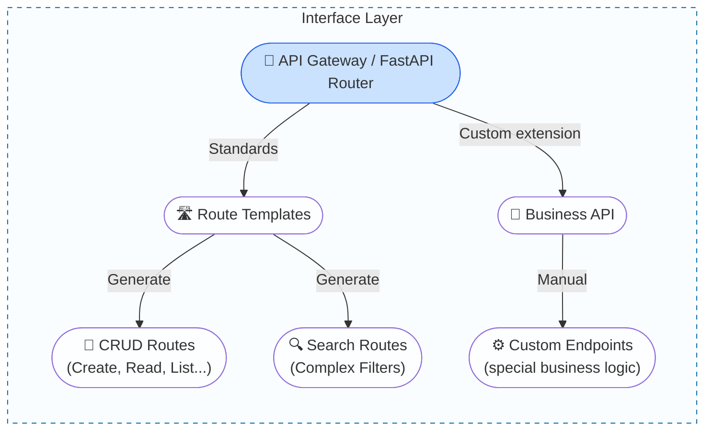
```mermaid
flowchart TD
    subgraph Interface ["Interface Layer"]
        direction TB
        API(["🔗 API Gateway / FastAPI Router"])
        
        API --> |"Standards"| RT(["🛣️ Route Templates"])
        API --> |"Custom extension"| BA(["🧩 Business API"])
        
        RT --> |"Generate"| CRUD(["📝 CRUD Routes<br/>(Create, Read, List...)"])
        RT --> |"Generate"| SEARCH(["🔍 Search Routes<br/>(Complex Filters)"])
        BA --> |"Manual"| CUSTOM(["⚙️ Custom Endpoints<br/>(special business logic)"])
    end

    %% Styling
    style API fill:#60a5fa50,stroke:#2563eb
    style Interface fill:#f0f9ff50,stroke:#0369a1,stroke-dasharray: 5 5
    style RT fill:#ffffff50
    style BA fill:#ffffff50
    style CRUD fill:#ffffff50
    style SEARCH fill:#ffffff50
    style CUSTOM fill:#ffffff50
```

This layer determines what the API “looks like.” Based on the schema registered by the developer, the `AutoCRUD Interface` automatically generates the corresponding routes via the `IRouteTemplate` interface.

- **Route Templates**: Provide standard CRUD operations (Create, Update, List...).
- **Business API**: Developers can write custom FastAPI routes and directly call the system-generated `ResourceManager` to reuse underlying capabilities (such as permissions and versioning) without reinventing the wheel.
- **Responsibilities**: Parse HTTP request parameters -> call the Resource Manager -> format the response.

### 3. Service Layer: `ResourceManager`

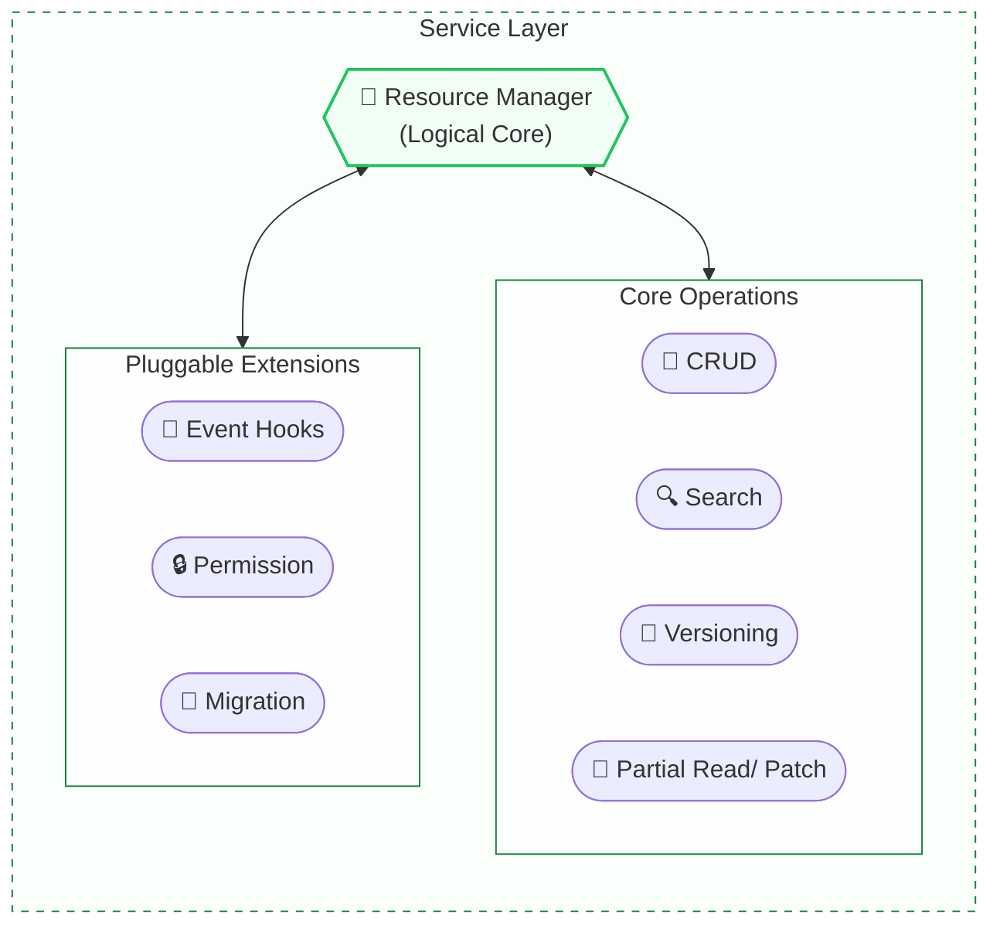
```mermaid
flowchart TD
    subgraph Service ["Service Layer"]
        direction TB
        RM{{"🧠 Resource Manager<br/>(Logical Core)"}}
        
        subgraph Ops ["Core Operations"]
            direction LR
            CRUD(["📝 CRUD"])
            SEARCH(["🔍 Search"])
            VER(["📜 Versioning"])
            PARTIAL(["🧩 Partial Read/ Patch"])
        end
        
        subgraph Plugins ["Pluggable Extensions"]
            direction LR
            EVENT(["🔔 Event Hooks"])
            PERM(["🔒 Permission"])
            MIG(["🔄 Migration"])
        end
        
        RM <--> Ops
        RM <--> Plugins
    end

    %% Styling
    style RM fill:#dcfce750,stroke:#22c55e,stroke-width:2px
    style Service fill:#f0fdf450,stroke:#15803d,stroke-dasharray: 5 5
    style Ops fill:#ffffff50,stroke:#15803d
    style Plugins fill:#ffffff50,stroke:#15803d
```

`ResourceManager` is the “brain” of AutoCRUD and the place where all custom logic happens. It is automatically instantiated by the `AutoCRUD Interface` during system startup and is responsible for orchestrating all components. After a route receives a request, it is handed off to `ResourceManager` for processing.

Its standard operating procedure (SOP) is as follows:

1. **Context Setup**: Create the runtime context (including user and timestamp).
2. **Permission Check**: Call `IPermissionChecker` to verify the operator’s permissions.
3. **Before Hooks**: Trigger `before` events (e.g., data validation, auto-fill).
4. **Action Execution**: Execute the actual action (CRUD, revision switching, or search).
5. **Status Hooks**: Trigger `on_success` or `on_error` based on the result.
6. **After Hooks**: Trigger `after` events (always run cleanup regardless of success or failure).
7. **Response Construction**: Package and return the result.

### 4. Persistence Layer: Multi-Store Strategy

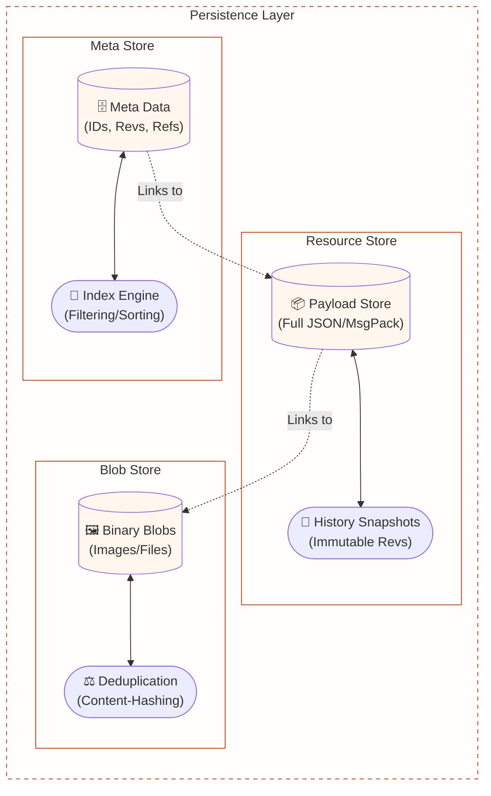
```mermaid
flowchart TD
    subgraph Persistence ["Persistence Layer"]
        direction TB
        
        subgraph Meta ["Meta Store"]
            META[("🗄️ Meta Data<br/>(IDs, Revs, Refs)")]
            IDX(["🔎 Index Engine<br/>(Filtering/Sorting)"])
            META <--> IDX
        end
        
        subgraph Data ["Resource Store"]
            RES[("📦 Payload Store<br/>(Full JSON/MsgPack)")]
            SNAP(["📜 History Snapshots<br/>(Immutable Revs)"])
            RES <--> SNAP
        end
        
        subgraph Blobs ["Blob Store"]
            BLOB[("🖼️ Binary Blobs<br/>(Images/Files)")]
            DEDUP(["⚖️ Deduplication<br/>(Content-Hashing)"])
            BLOB <--> DEDUP
        end
        
        META -.-> |"Links to"| RES
        RES -.-> |"Links to"| BLOB
    end

    %% Styling
    style Persistence fill:#fff7ed30,stroke:#c2410c,stroke-dasharray: 5 5
    style Meta fill:#ffffff30,stroke:#c2410c
    style Data fill:#ffffff30,stroke:#c2410c
    style Blobs fill:#ffffff30,stroke:#c2410c
    style META fill:#fed7aa30
    style RES fill:#fed7aa30
    style BLOB fill:#fed7aa30
```

To satisfy **high-efficiency search**, **large-scale storage**, and **binary file management** at the same time, AutoCRUD adopts a three-tier storage separation strategy:

- **Meta Store**:

  - Stores resource metadata (ID, CreatedTime, Tags, RevisionID) and indexed fields.
  - Typically backed by a relational database (Postgres, SQLite) or a high-performance KV store (Redis).
  - **Responsibilities**: `Search`, `Filter`, `Sort`, `Pagination`.
- **Resource Store**:

  - Stores the full JSON/MsgPack payload and historical snapshots (revision blobs).
  - Typically backed by object storage (S3, MinIO) or a file system.
  - **Responsibilities**: `Load`, `Dump`, `History Management`.
- **Blob Store**:

  - Dedicated to storing unstructured binary data (images, PDFs, videos).
  - `Binary` fields in a resource store only reference IDs; the actual content is stored here.
  - **Responsibilities**: `File Upload/Download`, `Streaming`, `Signed URL Generation`.
## Interaction Flow Example

Using “Create Resource” as an example:

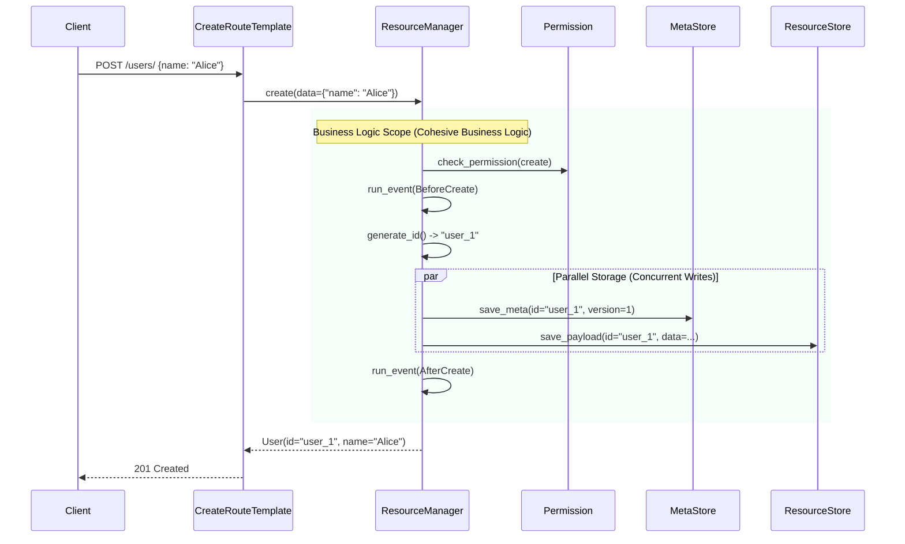
```mermaid
sequenceDiagram
    participant Client
    participant API as CreateRouteTemplate
    participant RM as ResourceManager
    participant Perm as Permission
    participant Meta as MetaStore
    participant Store as ResourceStore

    Client->>API: POST /users/ {name: "Alice"}
    API->>RM: create(data={"name": "Alice"})
    
    rect rgb(220, 252, 231, 0.3)
        Note over RM: Business Logic Scope (Cohesive Business Logic)
        RM->>Perm: check_permission(create)
        RM->>RM: run_event(BeforeCreate)
        RM->>RM: generate_id() -> "user_1"
        
        par Parallel Storage (Concurrent Writes)
            RM->>Meta: save_meta(id="user_1", version=1)
            RM->>Store: save_payload(id="user_1", data=...)
        end
        
        RM->>RM: run_event(AfterCreate)
    end
    
    RM-->>API: User(id="user_1", name="Alice")
    API-->>Client: 201 Created
```

With this architecture, AutoCRUD allows developers to focus on **defining data**, while delegating the complexity of infrastructure setup to the system.

## Deep Dive Features

### 1. Versioning Model

AutoCRUD provides a comprehensive built-in versioning mechanism. Every change to a resource produces a new `Revision`.

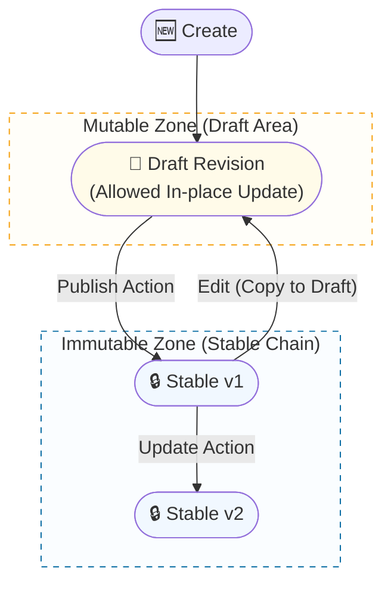
```mermaid
flowchart TD
    subgraph DraftZone ["Mutable Zone (Draft Area)"]
        D1(["📝 Draft Revision<br/>(Allowed In-place Update)"])
    end

    subgraph StableZone ["Immutable Zone (Stable Chain)"]
        S1(["🔒 Stable v1"])
        S2(["🔒 Stable v2"])
        S1 --> |"Update Action"| S2
    end

    Start([🆕 Create]) --> D1
    D1 --> |"Publish Action"| S1
    S1 --> |"Edit (Copy to Draft)"| D1

    %% Styling
    style DraftZone fill:#fffbeb50,stroke:#f59e0b,stroke-dasharray: 5 5
    style StableZone fill:#f0f9ff50,stroke:#0369a1,stroke-dasharray: 5 5
    style D1 fill:#fef3c750
    style S1 fill:#dbeafe50
    style S2 fill:#dbeafe50
```

* **Revision States**:

  * `draft`: Draft state. Allows in-place updates without creating a new version.
  * `stable`: Stable state. Once in this state, any modification will forcibly create a brand-new Revision ID.
* **Linking & Rollback**:

  * The system maintains a `parent_revision_id` pointing to the source version, forming a complete change chain.
  * Developers can `switch` a resource back to any historical stable version at any time.
* **Schema Version Binding**: Each Revision records the `schema_version` used at the time, ensuring historical data can still be correctly parsed after Migration.

### 2. Infrastructure Decoupling

In traditional ORM projects, developers often spend significant effort on “infrastructure fields” and “architecture decisions” that are unrelated to business logic but unavoidable. AutoCRUD fully automates these chores, allowing you to define only the **Business Data Layer**.

```mermaid
flowchart LR
    subgraph ORM ["Traditional ORM (Scattered Focus)"]
        direction TB
        Dec1["🆔 ID: Int or UUID?<br/>DB-generated or App-generated?"]
        Dec2["⏰ Time: How to handle time zones?<br/>When to write Created/Updated?"]
        Dec3["👤 User: Should the field be created_by<br/>or creator_id?"]
        Dec4["🔏 Integrity: How to compute the hash?<br/>Manually increment version numbers?"]
    end

    subgraph AC ["AutoCRUD (Focused Effort)"]
        direction TB
        Core[("💡 Your Business Model")]
        Meta{{"⚙️ System Auto-Armor<br/>(ResourceMeta)"}}
        
        Core --> Meta
        Meta -.-> |"Auto-Gen"| ID["🆔 Unique Resource ID"]
        Meta -.-> |"Auto-Sync"| Time["⏰ Timestamp (ISO/UTC)"]
        Meta -.-> |"Auto-Inject"| User["👤 Operator Tracking"]
        Meta -.-> |"Auto-Calc"| Hash["🔏 Data Hash & Revisions"]
    end

    classDef focus fill:#dcfce750,stroke:#22c55e,stroke-width:2px;
    class Core focus;
```

* **Eliminate Repetitive Definitions**: Fields that every resource inevitably has—such as `resource_id`, `revision_id`, `created_at`, `updated_at`, `created_by`, `updated_by`—do not need to be written in the Schema. AutoCRUD manages them automatically via `ResourceMeta` and `RevisionInfo`.
* **Consistent Architecture Decisions**:

  * **ID Strategy**: Unified content-addressed/random IDs with type tags, eliminating debates over auto-increment efficiency and security.
  * **Time Zones & Write Timing**: The entire system uses UTC/ISO format and captures timestamps automatically in the `ResourceManager` core steps, eliminating bugs caused by “forgetting to update timestamps”.
  * **Operator Tracking**: Through Context injection, the system automatically tracks who performed the Create/Update, without manually passing User objects through every layer.
* **Focus on “Change”**: The auto-generated `data_hash` ensures that a new version is created only when the content actually changes, avoiding redundant writes and version noise.

### 3. Security & Permissions

Permission validation is integrated into the core flow of `ResourceManager`, ensuring protection whether access is via API or internal calls.

```mermaid
flowchart TD
    REQ(["📩 API Request"]) --> AUTH{{"🛡️ Auth Chain"}}
    
    subgraph Layers ["Multi-layer Verification Mesh"]
        direction TB
        GLOBAL{"🌐 Global Rules<br/>(RBAC)"}
        MODEL{"📦 Model Rules<br/>(Resource Type)"}
        ACL{"🔑 Resource ACL<br/>(Instance Level)"}
        
        GLOBAL --> |Pass| MODEL
        MODEL --> |Pass| ACL
    end

    AUTH --> Layers
    ACL --> |"Success"| OK(["✅ Authorized"])
    
    GLOBAL -- "Deny" --> FAIL(["🚫 403 Forbidden"])
    MODEL -- "Deny" --> FAIL
    ACL -- "Deny" --> FAIL

    %% Styling
    style Layers fill:#f8fafc50,stroke:#475569,stroke-dasharray: 5 5
    style OK fill:#dcfce750,stroke:#22c55e
    style FAIL fill:#fee2e250,stroke:#ef4444
```

* **RBAC (Role-Based Access Control)**: Supports role-based permission management. Define roles such as `admin`, `editor`, and `viewer` with different operation permissions per resource.
* **Multi-layer Verification**:

  1. **Global Level**: Application-wide default permissions.
  2. **Model Level**: Permissions for specific data models.
  3. **Resource Level (ACL)**: Access control lists for individual resource instances.
* **Custom Validators**: By implementing `IPermissionChecker`, developers can write complex logic (e.g., only the resource owner can modify it within a specific time window).

### 4. Event-Driven Hooks

AutoCRUD provides flexible event Hook points, allowing developers to extend functionality without intruding on core logic.

```mermaid
sequenceDiagram
    participant RM as ResourceManager
    participant EH as EventHandler
    participant Store as Persistence Layer

    RM->>EH: trigger(BeforeAction)
    activate EH
    EH-->>RM: continue
    deactivate EH
    
    Note over RM, Store: Execute Core Action
    RM->>Store: execute(Action)
    
    alt Success Case
        Store-->>RM: result
        RM->>EH: trigger(OnSuccess)
    else Failure Case
        Store-->>RM: raise Exception
        RM->>EH: trigger(OnError)
    end
    
    RM->>EH: trigger(AfterAction) (Always)
```

* **Four Event Hooks**:

  * `Before`: Triggered before executing an action. Useful for advanced data validation and field auto-completion (e.g., auto-filling `created_by`).
  * `OnSuccess`: Triggered after a successful action. Useful for sending Webhooks, clearing caches, and sending email notifications.
  * `OnError`: Triggered when an action fails. Useful for error tracking, real-time alerts, or compensation logic.
  * `After`: Triggered after the action completes (regardless of success or failure). Ideal for final resource cleanup or audit logging.
### 5. Binary Data Optimization (Binary Data Optimization)

For unstructured data (Files), AutoCRUD adopts “field-level transparent handling”:

```mermaid
flowchart TD
    RAW(["📄 Raw Bytes (Upload)"]) --> RM{{"🧠 Resource Manager"}}
    RM --> HASH["🧮 Content Hashing<br/>(XXH3-128)"]
    
    subgraph Storage ["Blob Store Logic"]
        HASH --> BLOB{{"🔍 Exists?"}}
        BLOB -- "No" --> SAVE["💾 Save to Object Store"]
        BLOB -- "Yes" --> SKIP["⏭️ Skip Upload"]
    end
    
    SAVE & SKIP --> REF["🔑 Get File Reference ID"]
    REF --> META["📝 Store ID in MetaStore"]

    %% Styling
    style RM fill:#dcfce750,stroke:#22c55e
    style Storage fill:#fcfaf850,stroke:#c2410c,stroke-dasharray: 5 5
```

* **Binary Struct**: When the Schema uses the `Binary` type, the system automatically handles uploading and storage.
* **Deduplication**: The Blob Store stores files based on the content hash. If multiple resources upload the same image, the physical file is stored only once, saving space.
* **Lazy Loading**: When querying resource lists, the system does not include raw binary content. Instead, it returns file Metadata (ID, Size, Content-Type). The Blob Store provides streaming only when an explicit download is requested.

### 6. Schema Evolution & Migration (Schema Evolution & Migration)

As the business evolves, data models will inevitably change. AutoCRUD provides a semi-automated migration path:

```mermaid
flowchart TD
    READ(["📥 Read Request"]) --> RM{{"🧠 Resource Manager"}}
    RM --> VER{{"🔢 Version Check"}}
    
    VER -- "Match" --> RET(["✅ Return Data"])
    
    subgraph Migration ["On-the-fly Upgrade"]
        VER -- "Old Version" --> CONV["⚡ Apply Converter<br/>(Python Function)"]
        CONV --> MAP["🧪 Transform to New Schema"]
    end
    
    MAP --> RET
    MAP -. "Lazy Write" .-> WRITE["💾 Update Storage<br/>(Next Write Operation)"]

    %% Styling
    style RM fill:#dcfce750,stroke:#22c55e
    style Migration fill:#fff7ed50,stroke:#c2410c,stroke-dasharray: 5 5
```

* **Multiple versions coexisting**: The system allows data with different `schema_version` values to coexist within the same `ResourceManager`.
* **Migration Scripts**: When developers upgrade a model, they can provide a `Converter`. When older-version data is read, the system automatically applies the Converter to upgrade it to the latest format.
* **Lazily Update**: Data does not need to be migrated all at once (to avoid downtime). Instead, it is upgraded dynamically on read, and stored as the new version on the next write, distributing database load.

### 7. Partial Update (RFC 6902 JSON Patch)

To keep developers from having to implement the complex “read → merge → write back” logic, AutoCRUD adopts the **RFC 6902 JSON Patch** standard. Developers only need to send “change operations”; the remaining atomic operations and type checks are automatically handled by the system.

```mermaid
sequenceDiagram
    participant User as 🧑‍💻 Client / Developer
    participant RM as 🧠 Resource Manager
    participant Store as 📦 Hybrid Storage
    
    User->>RM: PATCH (ID, Patch Ops)
    Note right of User: 💡 Only send “change operations”<br/>(e.g., replace /status with "active")

    rect rgb(232, 240, 254, 0.6)
        Note over RM: ⚡ Atomic Patch Workflow
        RM->>Store: 1. Fetch the latest current data
        Store-->>RM: Raw data (Full Payload)
        RM->>RM: 2. Precisely apply Ops in memory
        Note over RM: No database impact, computed only in a staging area
        RM->>RM: 3. Type-safe validation (msgspec)
        Note over RM: Ensure the updated data still conforms to the Schema
    end
    
    RM->>Store: 4. Generate and persist a new Revision
    RM-->>User: 200 OK (return the full updated resource)
```

* **No Manual Merge**: You don’t need to write `if field in data: obj.field = data.field` in your code. Just describe “what I want to do to path X”, and the system guarantees correctness.
* **Standardized operation set**: Supports standard ops such as `add`, `remove`, `replace`, `move`, `copy`, `test`, and can handle deeply nested structures (e.g., `/metadata/tags/0`).
* **Atomicity**: Read, apply, validate, and write are executed within a controlled lifecycle, ensuring no dirty intermediate states are produced.
* **Strong typing guardrails**: Even though the Patch ops are dynamic, the final result must pass `msgspec` strong type validation; otherwise it errors out and the update is aborted.
* **Automatic version tracking**: Every successful Patch automatically creates a revision record for easy rollback at any time.

### 8. Partial Read & Dynamic Schema (Partial Read & Dynamic Schema)

To further improve performance and reduce network bandwidth usage, AutoCRUD supports “partial read”, powered by a robust **Dynamic Schema Generation** technique.

```mermaid
flowchart TD
    BASE["📦 Base Model"] --> GEN{{"⚙️ Partial Type Generator"}}
    PATHS(["📍 JSON Paths / Pointers<br/>(e.g. name, /meta/title)"]) --> GEN
    
    subgraph TypeGen ["⚡ Just-in-Time Schema"]
        GEN --> DYNAMIC["🧪 Dynamic Struct Class<br/>(Sub-type of Base)"]
    end
    
    subgraph Decoding ["🚀 msgspec Fast Decoding"]
        STORAGE[("🗄️ Storage bytes")] --> DECODE{{"🧩 Specialized Decoder"}}
        DYNAMIC -. "Constraint" .-> DECODE
        DECODE --> OBJ(["🎁 Partial Object"])
    end
    
    OBJ --> RES(["📤 Response"])

    %% Styling
    style TypeGen fill:#f5f3ff50,stroke:#7c3aed,stroke-dasharray: 5 5
    style Decoding fill:#f0fdf450,stroke:#15803d,stroke-dasharray: 5 5
```

* **Just-in-Time Schema**: Based on requested field paths, the system uses `create_partial_type` to generate a `msgspec.Struct` class on the fly that contains only the target fields.
* **Efficient Decoding**: Unlike the traditional approach of “read into memory → convert to Dict → filter”, AutoCRUD passes the dynamically generated Schema to the `msgspec` decoder. This allows the underlying C-based decoder to skip fields that do not need processing while scanning the byte stream.
* **Dual optimization for memory and bandwidth**:

  * **Memory**: Only instantiate the required object nodes.
  * **Bandwidth**: For resources with large full-text search content or complex nested structures, partial reads can significantly reduce the resulting JSON payload size.
* **Use cases**: Pagination lists showing only summaries, mobile low-data mode, precise field selection in GraphQL.

### 9. GraphQL Integration (GraphQL Integration)

In addition to RESTful APIs, AutoCRUD also natively supports GraphQL, achieving “define once, expose two interfaces”.

```mermaid
flowchart TD
    Schema(["📦 Msgspec Schema"]) --> |"Introspection"| GQLGen{{"✨ GraphQL Generator"}}
    
    subgraph GQL ["Auto-Generated Layer"]
        GQLGen --> GQLType["🟣 GraphQL Types"]
        GQLType --> Query["🔍 Queries<br/>(Auto-Filter)"]
        GQLType --> Mutation["✍️ Mutations<br/>(Auto-Action)"]
    end
    
    Client(["🧑‍💻 Client Query"]) --> Res{{"🛡️ Resolver"}}
    Res --> |"Delegate"| RM{{"🧠 Resource Manager"}}

    %% Styling
    style GQL fill:#f5f3ff50,stroke:#7c3aed,stroke-dasharray: 5 5
    style GQLType fill:#ede9fe50
```

* **Auto-Mapping**: Using the `Strawberry` library, msgspec models are automatically converted into GraphQL Types.
* **Rich search capabilities**: Auto-generated GraphQL Queries support full filter conditions (DataSearchOperator), with native mappings such as `eq`, `gt`, `contains`.
* **Unified logic**: Under the hood, GraphQL Resolvers call the same `Resource Manager`, so all permission checks, event hooks, and versioning logic remain fully consistent.

### 10. Message Queue & Async Tasks (Message Queue & Async Tasks)

!!! info "New in version 0.7.0"

AutoCRUD treats “jobs” as a standard resource, integrating seamlessly with the core architecture through the `IMessageQueue` interface. This makes async processing no longer an architectural island, but a first-class citizen of the system.

```mermaid
flowchart LR
    APP(["🚀 Application"]) --> |"Enqueue"| MQ{{"📨 Message Queue"}}
    MQ --> |"Create Job Resource"| RM{{"🧠 Resource Manager"}}
    
    subgraph Worker ["Async Worker"]
        direction TB
        W(["⚙️ Consumer"]) --> |"ack/nack"| Q_BACKEND[("RabbitMQ / Memory")]
        W --> |"Update Status"| RM
    end

    RM <--> |"Persist State"| DB[("Storage")]
```

* **Job as Resource**: All async tasks (e.g., sending emails, generating reports) are encapsulated as `Job` resources. This means the task itself also benefits from **versioning**, **permissions**, and **lifecycle events**. Administrators can query execution history and status just like ordinary data.
* **Observable state**: Task state transitions (Pending, Processing, Completed, Failed) are strictly governed by `ResourceManager`. Combined with Event Hooks, alerts can be triggered automatically when a task fails.
* **Backend-neutral**: Supports different backends such as `Memory` (for development) and `RabbitMQ` (for production), and provides an automatic retry (Retry) mechanism to ensure consistency under high concurrency.

## Conclusion

AutoCRUD's architectural design is intended to **eliminate repetitive foundational work in the development process**. Through clear separation of responsibilities and a highly modular component design, it not only provides out-of-the-box automation, but also retains the flexibility needed to handle complex business scenarios. Whether it's a simple data labeling admin panel or a complex content management system (CMS), AutoCRUD provides a stable and scalable foundation.
