# 🗂️ Resource Manager

ResourceManager is the core class in AutoCRUD. It manages CRUD operations, versioning, indexing, permissions, events, and more across different resource types. This document introduces its key concepts, commonly used methods, and practical examples.

---

## Resource Management Philosophy

- **Focus on business logic**: metadata is managed automatically; business code only defines the resource payload  

    All resource metadata (e.g., id, creator, timestamps, schema version) is separated from the payload. This reduces repeated design work and enables auto-generation, querying, sorting, and indexing.  
    Developers no longer need to redefine basic fields like `id`, `created/updated by/time`, or `hash` for every resource. This also eliminates the recurring trivial decisions every time you create a resource: should the `id` be an `int` or a `str`? Should it auto-increment? How should time zones be handled? AutoCRUD standardizes these non-business-but-necessary infrastructure details.

    ➡️ *[Resource Meta & Revision Info](#resource-meta-revision-info)*

- **Complete versioning**: every operation is traceable and reversible  

    Every update and delete creates a new revision. You can inspect history, switch revisions, list all revisions, and restore deleted resources.

    ➡️ *[Version Control](#version-control)*

- **Multiple storage mechanisms**: PostgreSQL, S3, Redis  

    Metadata and payload are stored separately: metadata can use an RDBMS for fast lookup by any indexed field,
    while the payload can use S3 or Disk for fast key-value reads.  

    ➡️ *[Storage](auto_routes.md#storage)*

- **Event-driven architecture (Event Driven)**: supports Sync and Async handling  

    - **Sync (Synchronous)**: directly participates in the request lifecycle (Before/After); suitable for validation and transactional consistency updates.
    - **Async (Asynchronous)**: handles time-consuming tasks via Message Queue integration or Background Tasks, without blocking API responses.

    ➡️ *[Event Handling](#event-handling)*

- **Flexible schema changes**: schema versioning with custom migration logic  

    When you need an incompatible schema update, you only need to define minimal, business-only migration logic to support auto-upgrade and data migration.
    
    ➡️ *[Schema Migration](#schema-migration)*

- **Advanced features are resource-centric**: permissions, event-driven workflows, backups  

    Permission checks can be as granular as the resource level. Event handling supports multiple phases. Index querying and backup/restore are easy to integrate with third-party systems.
    
    ➡️ *[Advance Usage](#advance-usage)*

---

## Differences Between Resource Manager and Traditional ORMs (e.g., SQLAlchemy)

- **No Foreign Keys; behavior is explicit in code**  

    - No behavior hidden in database settings: Foreign keys often enable automatic behaviors like `ON DELETE/UPDATE CASCADE` or `SET NULL`. Once enabled at the DB layer, they remain active even if application logic changes, making behavior not fully visible in code and hard to audit or test from the codebase perspective (unless you also update the DB schema).  
    - Indexes are not foreign keys: If your goal is query performance or indicating a relationship, an index is sufficient. The core purpose of foreign keys is referential integrity and (optional) automatic behaviors—not query capability. Use foreign keys only when you need DB-level consistency; otherwise, use indexes.  
    - No relationships or foreign-key markers: AutoCRUD does not support cross-resource “relationships” or foreign-key markers, and it does not enforce referential integrity or enable automatic behaviors at the DB layer. You can store another resource’s `resource_id` or `revision_id` as a business field, but the framework does not treat it as a foreign key and will not introduce implicit side effects.  
    - WYSIWYG, event-driven: All behavior is explicitly represented in code. If you need cascade delete or synchronized updates, implement them explicitly via an event handler. No handler means no implicit action. This keeps the system simpler, more readable, testable, and auditable.  

- **Versioning**  

    - Versioning is a first-class concept: Every create, update, and patch produces a new revision, preserving full history. Traditional ORMs typically overwrite in-place and require custom design to retain versions.  
    - Switch and restore: Supports listing revisions, reading any revision, switching to a specified revision, and restoring after a soft delete. Traditional ORMs typically do not provide built-in revision switching and restoration.  
    - Draft vs. stable separation: Draft status allows in-place modification without creating a new revision (`modify`), then you can create a new revision as stable after confirmation. Most ORMs do not provide this built-in state flow and in-place editing mode.  
    - Deletes still preserve history: Deletes are soft deletes; data and revisions remain. Traditional ORMs often hard delete unless extended.  
    - Query- and audit-friendly: Full revision history and traceable behavior make it suitable for diffing, auditing, and recovery; traditional ORMs usually need separate audit tables or event mechanisms to reach similar capability.  
    
    ➡️ *[Version Control](#version-control)*

- **Schema Migration**  

    - Similar to [Alembic](https://alembic.sqlalchemy.org/en/latest/), but places more emphasis on observability for "cross-version field changes".
    - You only need to provide one function: input old-schema data (`IO[bytes]`), output a new-schema object.
    - Migration details are fully under your control—simple and transparent.  

    ➡️ *[Schema Migration](#schema-migration)*

- **Pure Python**  

    - Implemented and used entirely in Python, with no framework coupling or hidden magic; easy to read, test, and integrate, with low deployment and operations cost.

- **Event Driven**  

    - Extend behavior via events: supports custom event handlers to inject logic during create, update, delete, migrate, and more.
    - For workflows like cascade delete, synchronized updates, or notifications, implement explicitly via events; if no event is registered, no implicit action occurs.

- **Permission Management**  

    - Resource-centric permission checks: inject `IPermissionChecker` to enforce fine-grained read/write control down to the resource/revision level.
    - Supports contextual permissions (by user/time/status), combined strategies, and auditing requirements; easy to integrate with existing authentication systems.

---

## Registering Resources

Register models with AutoCRUD and obtain a ResourceManager instance:

```python hl_lines="9"
from autocrud import AutoCRUD
from msgspec import Struct

class TodoItem(Struct):
    title: str
    completed: bool

autocrud = AutoCRUD(default_user="user", default_now=datetime.now)
autocrud.add_model(TodoItem)
manager = autocrud.get_resource_manager(TodoItem)
```

You can specify parameters such as storage, migration, and indexed_fields when calling add_model. AutoCRUD will automatically create and manage the ResourceManager.

```python hl_lines="3"
autocrud.add_model(
    TodoItem,
    indexed_fields=["completed"],
)
```

---

### Terminology

| Method            | Description                                                                                                                                                                                                                                                            | Example                    |
| ----------------- | ---------------------------------------------------------------------------------------------------------------------------------------------------------------------------------------------------------------------------------------------------------------------- | -------------------------- |
| `resource_type`   | The resource type                                                                                                                                                                                                                                                      | TodoItem                   |
| `resource_id`     | The unique identifier of a resource. Each resource has its own independent resource_id. Similar to a Git repo name: no matter how the content changes, the repo name stays the same.                                                                                   | `todo-item:1fff687d5e8f`   |
| `revision_id`     | The unique identifier of a resource revision. Every time the resource content changes (e.g., update, modify), a new revision_id is generated (Create New Revision). Similar to a Git commit hash: each commit produces a new hash and records who updated it and when. | `todo-item:1fff687d5e8f:1` |
| `resource_name`   | The resource class name. Used when retrieving a manager from autocrud, and also used by the auto-generated CRUD API endpoints.                                                                                                                                         | todo-item                  |
| `revision_status` | The status of the current revision. Common statuses include stable and draft, which affect which operations are allowed. When status is stable, in-place modification without creating a new revision (modify) is not allowed; only draft supports it.                 | stable/draft               |
| `indexed_field`   | An indexed field used for fast lookup and sorting.                                                                                                                                                                                                                     | title/completed            |
| `schema_version`  | The schema version of the resource.                                                                                                                                                                                                                                    | None/v1                    |

---

## Resource Operations

| Method                                                                                                                                                          | Description                                                                                                                                                                       |
| --------------------------------------------------------------------------------------------------------------------------------------------------------------- | --------------------------------------------------------------------------------------------------------------------------------------------------------------------------------- |
| [#Create](#create)                                                                                                                                              |                                                                                                                                                                                   |
| [`create(data, status=...)`](../reference/resource_manager/core.md#autocrud.resource_manager.core.ResourceManager.create)                                       | Create a new resource                                                                                                                                                             |
| [#Read](#read)                                                                                                                                                  |                                                                                                                                                                                   |
| [`get(resource_id)`](../reference/resource_manager/core.md#autocrud.resource_manager.core.ResourceManager.get)                                                  | Get the latest revision of a resource                                                                                                                                             |
| [`get_resource_revision(resource_id, revision_id)`](../reference/resource_manager/core.md#autocrud.resource_manager.core.ResourceManager.get_resource_revision) | Get a specific revision                                                                                                                                                           |
| [`search_resources(query)`](../reference/resource_manager/core.md#autocrud.resource_manager.core.ResourceManager.search_resources)                              | Search resources (supports indexing, pagination, sorting)                                                                                                                         |
| [`count_resources(query)`](../reference/resource_manager/core.md#autocrud.resource_manager.core.ResourceManager.count_resources)                                | Count resources                                                                                                                                                                   |
| [`list_revisions(resource_id)`](../reference/resource_manager/core.md#autocrud.resource_manager.core.ResourceManager.list_revisions)                            | List all revisions                                                                                                                                                                |
| [#Update](#update)                                                                                                                                              |                                                                                                                                                                                   |
| [`update(resource_id, data, status=...)`](../reference/resource_manager/core.md#autocrud.resource_manager.core.ResourceManager.update)                          | Full update; creates a new revision id (Create New Revision)                                                                                                                      |
| [`patch(resource_id, patch_data)`](../reference/resource_manager/core.md#autocrud.resource_manager.core.ResourceManager.patch)                                  | Apply JSON Patch; creates a new revision id (Create New Revision)                                                                                                                 |
| [`modify(resource_id, data/patch, status=...)`](../reference/resource_manager/core.md#autocrud.resource_manager.core.ResourceManager.modify)                    | Full or partial update without creating a new revision id (In-place Modification (without creating new revision)); only allowed when status is draft; fails when status is stable |
| [`switch(resource_id, revision_id)`](../reference/resource_manager/core.md#autocrud.resource_manager.core.ResourceManager.switch)                               | Switch to a specified revision                                                                                                                                                    |
| [#Delete](#delete)                                                                                                                                              |                                                                                                                                                                                   |
| [`delete(resource_id)`](../reference/resource_manager/core.md#autocrud.resource_manager.core.ResourceManager.delete)                                            | Soft delete a resource                                                                                                                                                            |
| [`restore(resource_id)`](../reference/resource_manager/core.md#autocrud.resource_manager.core.ResourceManager.restore)                                          | Restore a deleted resource                                                                                                                                                        |
| [#Management](#management)                                                                                                                                      |                                                                                                                                                                                   |
| [`migrate(resource_id)`](../reference/resource_manager/core.md#autocrud.resource_manager.core.ResourceManager.migrate)                                          | Run schema migration                                                                                                                                                              |
| [`dump()`](../reference/resource_manager/core.md#autocrud.resource_manager.core.ResourceManager.dump)                                                           | Backup all resource data                                                                                                                                                          |
| [`load(key, bio)`](../reference/resource_manager/core.md#autocrud.resource_manager.core.ResourceManager.load)                                                   | Restore data                                                                                                                                                                      |

### Create

Create a new resource. Generates a unique resource_id and the first revision.
Commonly used to add new data; supports specifying an initial status (e.g., draft/stable).

* [`create(data, status=...)`](../reference/resource_manager/core.md#autocrud.resource_manager.core.ResourceManager.create): Create a new resource and return `ResourceMeta`.

```python
manager: ResourceManager[TodoItem]
# Create a new TodoItem resource
info: ResourceMeta = manager.create(TodoItem(title="milk", completed=False), status="draft")
print(info.resource_id)  # Get the new resource_id
```

### Read

Get the latest or a specified revision of a resource. Supports search, pagination, sorting, counting, and listing revisions.

* [`get(resource_id, revision_id: str|UnsetType=UNSET)`](../reference/resource_manager/core.md#autocrud.resource_manager.core.ResourceManager.get): Get the latest revision of a resource.

When `revision_id` is not set, use the latest revision.

```python
# Get the current revision for the specified resource_id
resource = manager.get(resource_id)
print(resource.data)  # resource data
print(resource.info)  # resource info
```

* [`get_resource_revision(resource_id, revision_id)`](../reference/resource_manager/core.md#autocrud.resource_manager.core.ResourceManager.get_resource_revision): Get a specific revision.

```python
# Get the revision content for the specified resource_id and revision_id
resource = manager.get_resource_revision(resource_id, revision_id)
print(resource.data)  # resource data
print(resource.info)  # resource info
```

* [`get_partial(resource_id, revision_id: str|UnsetType=UNSET, partial: list[str|JsonPointer])`](../reference/resource_manager/core.md#autocrud.resource_manager.core.ResourceManager.get_partial): Retrieve a subset of the resource content, supporting nested fields and List Slicing.

!!! info "New in version 0.6.8"

When `revision_id` is not set, use the latest revision.

```python
# Retrieve partial fields
data = manager.get_partial(
    resource_id,
    partial=["title", "completed"]
)

# Supports nested fields and List Slicing
# Example: get the titles of the first two sub_items, and completed for all sub_items
data = manager.get_partial(
    resource_id,
    partial=[
        "sub_items/:2/title",     # titles of the first two sub_items
        "sub_items/-/completed"   # completed for all sub_items
    ]
)
```

!!! seealso
[Partial Read](#partial-read)

* [`search_resources(query)`](../reference/resource_manager/core.md#autocrud.resource_manager.core.ResourceManager.search_resources): Search resources by conditions (supports indexes, pagination, sorting).

!!! important
To use data_conditions, you must create an index for that field first. See [here](#data-attribute-index) for more information.
!!! seealso
[Resource Searching](#resource-searching)

```python
from autocrud.types import ResourceMetaSearchQuery, DataSearchCondition

# Search completed TodoItem
query = ResourceMetaSearchQuery(
    # To use data_conditions, you must create an index for that field
    data_conditions=[
        DataSearchCondition(field_path="completed", operator="eq", value=True)
    ]
)
metas = manager.search_resources(query)
for meta in metas:
    print(meta.resource_id, meta.indexed_data)
```

* [`count_resources(query)`](../reference/resource_manager/core.md#autocrud.resource_manager.core.ResourceManager.count_resources): Count how many resources match the query.

```python
# Count completed TodoItem
count = manager.count_resources(query)
print("Completed count:", count)
```

* [`list_revisions(resource_id)`](../reference/resource_manager/core.md#autocrud.resource_manager.core.ResourceManager.list_revisions): List all revision info.

```python
# List all revision info for the specified resource_id
revisions = manager.list_revisions(resource_id)
for rev in revisions:
    print(rev.revision_id, rev.status, rev.created_time)
```
### Update

Updating a resource’s content is split into **Create New Revision** (generates a new revision) and **In-place Modification** (draft-only).
!!! seealso
    [Versioning](#version-control)

- [`update(resource_id, data, status=...)`](../reference/resource_manager/core.md#autocrud.resource_manager.core.ResourceManager.update): Full update, creates a new revision.

```python
# Fully update the resource content and create a new revision
manager.update(resource_id, TodoItem(title="New Title", completed=True), status="stable")
```

- [`patch(resource_id, patch_data)`](../reference/resource_manager/core.md#autocrud.resource_manager.core.ResourceManager.patch): Apply a JSON Patch, creates a new revision.

```python
from jsonpatch import JsonPatch

# Partial update (JSON Patch) and create a new revision
patch = JsonPatch([{"op": "replace", "path": "/completed", "value": True}])
manager.patch(resource_id, patch)
```

!!! seealso
    JSON Patch defines a JSON document structure for describing a sequence of operations to apply to a JSON document; this format is well-suited for the HTTP PATCH method.  
    
    - [Python `jsonpatch` Official Documentation](https://python-json-patch.readthedocs.io/en/latest/tutorial.html#creating-a-patch)
    - [JSON Patch (RFC6902) Official Documentation](https://datatracker.ietf.org/doc/html/rfc6902)

- [`modify(resource_id, data/patch, status=...)`](../reference/resource_manager/core.md#autocrud.resource_manager.core.ResourceManager.modify): In-place Modification update (draft-only).

```python
# Modify the content directly in draft status (without creating a new revision)
manager.modify(resource_id, TodoItem(title="draft edit", completed=False))
# Or use a patch
manager.modify(resource_id, JsonPatch([{"op": "replace", "path": "/title", "value": "draft again"}]))
```

- [`switch(resource_id, revision_id)`](../reference/resource_manager/core.md#autocrud.resource_manager.core.ResourceManager.switch): Switch to the specified revision.

```python
# Switch to the revision with the specified revision_id
manager.switch(resource_id, revision_id)
```

---

### Delete

Soft delete a resource while preserving all revisions; it can be restored at any time.

- [`delete(resource_id)`](../reference/resource_manager/core.md#autocrud.resource_manager.core.ResourceManager.delete): Soft delete a resource.

```python
# Soft delete the specified resource
manager.delete(resource_id)
```

- [`restore(resource_id)`](../reference/resource_manager/core.md#autocrud.resource_manager.core.ResourceManager.restore): Restore a deleted resource.

```python
# Restore the deleted resource
manager.restore(resource_id)
```

---

### Management

Perform schema migration, data backup, and restore.

- [`migrate(resource_id)`](../reference/resource_manager/core.md#autocrud.resource_manager.core.ResourceManager.migrate): Run schema migration.  
!!! seealso
    [Schema Migration](#schema-migration)

```python
# Run schema migration
manager.migrate(resource_id)
```

- [`dump()`](../reference/resource_manager/core.md#autocrud.resource_manager.core.ResourceManager.dump): Backup all resource data.

```python
# Backup all resource data
backup = manager.dump()
```

- [`load(key, bio)`](../reference/resource_manager/core.md#autocrud.resource_manager.core.ResourceManager.load): Restore data.

```python
# Restore data
with open("backup_file", "rb") as bio:
    manager.load(key, bio)
```

---

## Examples

```python hl_lines="13 16 20 23 26"
from autocrud.resource_manager import ResourceManager
from autocrud.storage import LocalStorage

# Assume there is a TodoItem struct
class TodoItem(Struct):
    title: str
    completed: bool

storage = LocalStorage()
manager = ResourceManager(TodoItem, storage=storage)

# Create a resource
info = manager.create(TodoItem(title="test", completed=False))

# Query a resource
resource = manager.get(info.resource_id)
print(resource.data)

# Update a resource
manager.update(info.resource_id, TodoItem(title="done", completed=True))

# Delete a resource
manager.delete(info.resource_id)

# Restore a resource
manager.restore(info.resource_id)
```

---

## Resource Meta and Revision Info

Resource Meta is responsible for the overall resource state and indexing; Revision Info is responsible for per-revision details and tracking.

**Resource Meta records resource-level information**

- `resource_id`: Unique resource identifier
- `current_revision_id`: Current revision id
- `schema_version`: Current schema version of the data structure
- `total_revision_count`: Total number of revisions for this resource
- `created_time` / `updated_time`: Creation and last update time
- `created_by` / `updated_by`: Creator and last updater
- `is_deleted`: Whether the resource is deleted
- `indexed_data`: Indexed fields for fast lookup

**Revision Info records detailed information for each revision**

- `revision_id`: Unique revision identifier
- `parent_revision_id`: Parent revision id (if any)
- `schema_version` / `parent_schema_version`: Schema version for this revision and its parent
- `data_hash`: Data hash (used to detect whether content has changed)
- `status`: Revision status (stable/draft)
- `created_time` / `updated_time`: Creation and last update time
- `created_by` / `updated_by`: Creator and last updater


## Partial Read

!!! info "New in version 0.6.8"
`get_partial` allows you to read only a subset of a resource’s fields, which is especially useful when working with large objects or when you only need a small piece of information.

### Why would you care

Using `get_partial` can significantly improve read performance, especially when working with large objects.

Imagine a scenario where your resource object contains a large amount of data (for example, an `artifacts` list), but this operation only needs to read a few fields (for example, `name`). Fully decoding the entire object would cause unnecessary performance overhead.

To validate the benefits of `get_partial`, we designed a benchmark. In this experiment, we created user objects containing 1,000 `artifacts`, where each artifact’s `type` field is a random string of 200 to 20,000 characters.

We compared the performance of the following approaches:

| | Partial Read | Full Read |
| :--- | :--- | :--- |
| | Fully parse the entire JSON/Msgpack object | Parse and read only selected fields, skipping unnecessary data to improve performance |
| **msgspec (msgpack)** | ✅ (fastest) | ✅ |
| **msgspec (json)** | ✅ | ✅ |
| **pydantic (json)** | ✅ | ✅ |

The data structure used is as follows (json)

```json
{
  "name": "Hero",
  "artifacts": [
    {
      "id": "artifact_0",
      "type": "...",
      "power": 123
    },
    ...
  ],
  "level": 10
}
```

Here are the benchmark results:

Benchmark Results (ms):

| Method | Time (ms) | vs Fastest | Partial Speedup | Runs |
| :--- | :--- | :--- | :--- | :--- |
| msgspec+msgpack+partial | 0.0274 | 1.00x | **🚀 31.6x** (vs Full) | 37007 |
| msgspec+msgpack | 0.8671 | 31.63x | - | 1101 |
| msgspec+json+partial | 2.0374 | 74.31x | ⚡ 1.16x (vs Full) | 490 |
| msgspec+json | 2.3715 | 86.50x | - | 421 |
| pydantic+partial | 2.4517 | 89.42x | ⚡ 1.48x (vs Full) | 409 |
| pydantic | 3.6218 | 132.10x | - | 267 |

> **Key takeaway**: With Partial Read enabled, Msgpack improves performance by **31.6x**; JSON improves by only about **1.16x**. This confirms that Msgpack’s “length-prefixed skipping” is far better suited for partial reads than JSON’s “sequential scanning”.


For the full benchmark script, see `examples/benchmark_partial.py`.

#### Why do we recommend using Msgpack for Partial Read?

Msgpack is a binary serialization format. The core reason it is better suited than JSON for **Partial Read** is its **Efficient Skipping** mechanism:

1.  **Length-Prefixed**:
    *   In Msgpack, the beginning of a string, array, or map includes its **length information**.
    *   **Benefit**: When `msgspec`'s decoder encounters a field it doesn't need, it can read the length from the header, compute the next field's memory offset, and "skip" those bytes directly—without reading the content at all.

```mermaid
block-beta
    columns 5
    H1["Type: Str <br/> len=100"]:1
    D1["Char...(96 more)"]:2
    H2["Type: Int"]:1
    D2["(Val)"]:1

    columns 5
    P1(("👀")):1
    JUMP["── JUMP (Skip 100 Bytes) ──>"]:2
    P2(("🎯")):1
    space:1

    style H1 fill:#fee2e2,stroke:#ef4444
    style H2 fill:#fee2e2,stroke:#ef4444
```



2.  **JSON's limitations**:
    *   JSON is a text format and must rely on **Sequential Scanning** to find closing tokens (such as quotes `"` or braces `}`).
    *   **Drawback**: Even if the decoder doesn't need a large string field, it still must read every character to find where the value ends (and handle escape characters `\`), which burns a lot of CPU cycles.

```mermaid
block-beta
    columns 8
    Q1["''"]:1
    C1["C"]:1
    C2["h"]:1
    C3["a"]:1
    C4["r"]:1
    C5["96 more..."]:1
    Q2["''"]:1
    COMMA[","]:1

    columns 8
    P1(("👀")):1
    S1["→"]:1
    S2["→"]:1
    S3["→"]:1
    S4["→"]:1
    S5["→ 96 ..."]:1
    P2(("🎯")):1
    space:1

    style Q1 fill:#fee2e2,stroke:#ef4444
    style Q2 fill:#fee2e2,stroke:#ef4444
```



3.  **Extreme CPU optimization**:
    *   Combined with `msgspec`'s precompiled decoder, Msgpack skipping is almost equivalent to a simple pointer arithmetic operation. That's why in the benchmark, Msgpack Partial Read can be several times—or even tens of times—faster than JSON.

**Summary:** If your resources include large binary blobs, long text, or deeply nested structures, switching to Msgpack will maximize the performance gains of Partial Read.
#### Partial Schema and Generated Objects

When you call `get_partial`, AutoCRUD dynamically generates a new `Struct` type based on the `partial` paths you provide. This newly generated type preserves the original Schema structure as much as possible, but includes only the fields you requested.

* **Field preservation**: Requested fields keep their original types.
* **Non-requested fields**: Fields that are not requested will not appear in the generated object (or will be marked as `Unset`).
* **Structural consistency**: The generated object’s structure matches the original object’s structure. This means you can operate on a Partial object the same way you operate on the original object—there are just fewer available fields.

For example, given the original `TodoItem`:

```python
class TodoItem(Struct):
    title: str
    completed: bool
    sub_items: list[SubItem]
```

When you request `partial=["title"]`, the returned object type will look like:

```python
class Partial_TodoItem(Struct):
    title: str
    # completed and sub_items do not exist
```
This ensures both type safety and serialization efficiency.

#### Path Syntax

The `partial` parameter accepts a list of path strings or `JsonPointer`.

!!! note
    This syntax is a **superset of JsonPointer**.
    In addition to the standard JsonPointer specification, we provide the following extensions:

    1. **Optional leading slash**: For example, `"boss/name"` is equivalent to `"/boss/name"`.
    2. **List slicing (Slicing)**: Supports Python-style slicing syntax using `:`.

A rich syntax is supported to precisely select data:

- **Nested fields**: Use `/` to separate levels.
    - `"boss/name"`: Select `name` inside the `boss` object.

- **List index (Index)**: Specify a particular index.
    - `"items/0/name"`: Select `name` from the 1st item in the `items` list.

- **List wildcard (Wildcard)**: Use `-` to represent all elements.
    - `"items/-/name"`: Select `name` from all items in the `items` list.

- **List slicing (Slicing)**: Supports Python-style slicing syntax.
    - `"items/:2/name"`: First 2 items (`[:2]`).
    - `"items/1:3/name"`: 2nd to 3rd items (`[1:3]`).
    - `"items/::2/name"`: Every 2 items (`[::2]`).

**Examples:**

Assume the original resource data is:

```python
data = {
    "title": "Project A",
    "priority": "High",
    "assignee": {
        "name": "Alice",
        "email": "alice@example.com"
    },
    "sub_items": [
        {"title": "Task 1", "completed": True},
        {"title": "Task 2", "completed": False},
        {"title": "Task 3", "completed": False},
        {"title": "Task 4", "completed": True}
    ]
}
```

**1. Basic fields and nested objects**

```python
partial = ["title", "assignee/name"]
# Result:
{
    "title": "Project A",
    "assignee": {
        "name": "Alice"
    }
}
```

**2. List wildcard (Wildcard)**

```python
partial = ["sub_items/-/title"]
# Result:
{
    "sub_items": [
        {"title": "Task 1"},
        {"title": "Task 2"},
        {"title": "Task 3"},
        {"title": "Task 4"}
    ]
}
```

**3. List slicing (Slicing)**

Get the titles of the first two `sub_items`:

```python
partial = ["sub_items/:2/title"]
# Result:
{
    "sub_items": [
        {"title": "Task 1"},
        {"title": "Task 2"}
    ]
}
```

**4. Complex combinations**

Get `title` and the `completed` status of every 2 `sub_items`:

```python
partial = ["title", "sub_items/::2/completed"]
# Result:
{
    "title": "Project A",
    "sub_items": [
        {"completed": True},  # Task 1
        {"completed": False}  # Task 3
    ]
}
```

## Resource Searching

```python hl_lines="3-6"
# Query todo items created within the past 7 days
manager = autocrud.get_resource_manager(TodoItem)
query = ResourceMetaSearchQuery(
    created_time_start=datetime.now()-timedelta(days=7)
)
metas: list[ResourceMeta] = manager.search_resources(query)
count = manager.count_resources(query)
assert len(metas) == count
```

| Field                                                                                                   | Description                                                                                                                                     | Type                                                   |
| ------------------------------------------------------------------------------------------------------- | ----------------------------------------------------------------------------------------------------------------------------------------------- | ------------------------------------------------------ |
| [`is_deleted`](../reference/types.md#autocrud.types.ResourceMetaSearchQuery.is_deleted)                 | Whether the resource is deleted                                                                                                                 | bool                                                   |
| [`created_time_start`](../reference/types.md#autocrud.types.ResourceMetaSearchQuery.created_time_start) | Created at or after this time (inclusive)                                                                                                       | datetime                                               |
| [`created_time_end`](../reference/types.md#autocrud.types.ResourceMetaSearchQuery.created_time_end)     | Created at or before this time (inclusive)                                                                                                      | datetime                                               |
| [`updated_time_start`](../reference/types.md#autocrud.types.ResourceMetaSearchQuery.updated_time_start) | Updated at or after this time (inclusive)                                                                                                       | datetime                                               |
| [`updated_time_end`](../reference/types.md#autocrud.types.ResourceMetaSearchQuery.updated_time_end)     | Updated at or before this time (inclusive)                                                                                                      | datetime                                               |
| [`created_bys`](../reference/types.md#autocrud.types.ResourceMetaSearchQuery.created_bys)               | Created by                                                                                                                                      | list[str]                                              |
| [`updated_bys`](../reference/types.md#autocrud.types.ResourceMetaSearchQuery.updated_bys)               | Updated by                                                                                                                                      | list[str]                                              |
| [`conditions`](../reference/types.md#autocrud.types.ResourceMetaSearchQuery.conditions)                 | Search using meta fields or data indexed fields (see [General Filtering](#general-filtering-meta-data)) (**New in 0.6.9**)                      | list[DataSearchCondition or DataSearchGroup]           |
| [`data_conditions`](../reference/types.md#autocrud.types.ResourceMetaSearchQuery.data_conditions)       | (Deprecated) Search using data indexed fields (see [Data Search Filter](#data-search-filter) and [data attribute index](#data-attribute-index)) | list[DataSearchCondition or DataSearchGroup]           |
| [`sorts`](../reference/types.md#autocrud.types.ResourceMetaSearchQuery.sorts)                           | sort fields (see [sorting](#sorting))                                                                                                           | list[ResourceMetaSearchSort or ResourceDataSearchSort] |
| [`limit`](../reference/types.md#autocrud.types.ResourceMetaSearchQuery.limit)                           | pagination limit (see [pagination](#pagination))                                                                                                | int = 10                                               |
| [`offset`](../reference/types.md#autocrud.types.ResourceMetaSearchQuery.offset)                         | pagination offset (see [pagination](#pagination))                                                                                               | int = 0                                                |

### Query Builder

!!! info "New in version 0.7.5"


AutoCRUD provides a powerful **Query Builder (QB)** syntax that allows you to construct complex search conditions in a Pythonic way, including:

- **Comparison operators**: `==`, `!=`, `>`, `>=`, `<`, `<=`
- **Logical operators**: `&` (AND), `|` (OR), `~` (NOT)
- **String queries**: `.contains()`, `.startswith()`, `.endswith()`, `.regex()`
- **Field transformations**: `.length()` or `len()` sugar
- **Boolean helpers**: `.is_true()`, `.is_false()`, `.is_null()`, `.exists()`
- **Datetime queries**: `.between()`, `.in_list()`, `.not_in_list()`

**Quick example:**

```python
from autocrud.query import QB, len

# Build query conditions using QB
query = ResourceMetaSearchQuery(
    conditions=[
        # Name contains "Alice" and age is greater than 18
        (QB["name"].contains("Alice")) & (QB["age"] > 18),
        # Or: email exists and tag length is greater than 0
        QB["email"].exists() & (len(QB["tags"]) > 0)
    ]
)

metas = manager.search_resources(query)
```

!!! seealso
For a complete Query Builder tutorial and API reference, see [Query Builder Complete Guide](query_builder_guide.md)

### Data Attribute Index

When calling `AutoCrud.add_model`, you can specify which attributes should be indexed.
`ResourceMeta` will record the attributes configured to be used as indexes.
When searching, you can then use indexed fields as filter conditions.

```python hl_lines="3-11 18"
autocrud.add_model(
    TodoItem,
    indexed_fields=[
        # to use completed as an index.
        "completed",
        # ("completed", bool),
        # IndexableField("completed", str)
        
        # to use type as an index
        IndexableField("type", SpecialIndex.msgspec_tag)
    ]
)
...
manager = autocrud.get_resource_manager(TodoItem)
metas = manager.search_resources(ResourceMetaSearchQuery(
    data_conditions=[
        DataSearchCondition(
            field_path="completed", operator="eq", value=True,
        ),
    ]
))
```

`DataSearchCondition` and `DataSearchGroup` provide basic search capabilities. For detailed usage, see [DataSearchCondition](../reference/types.md#autocrud.types.DataSearchCondition) and [DataSearchGroup](../reference/types.md#autocrud.types.DataSearchGroup)
### General Filtering (Meta & Data)

!!! info "New in version 0.6.9"


`conditions` provides a unified search interface for filtering both **Metadata** (e.g., `resource_id`, `created_time`) and **Index Data** fields. This is more flexible than the legacy `data_conditions`.

**Supported Metadata fields**:

* `resource_id`, `revision_id`
* `created_time`, `updated_time`
* `created_by`, `updated_by`
* `is_deleted`

```python
# Filter both Metadata (created_time) and Data (completed) at the same time
query = ResourceMetaSearchQuery(
    conditions=[
        DataSearchCondition(field_path="created_time", operator="gt", value=datetime(2023, 1, 1)),
        DataSearchCondition(field_path="completed", operator="eq", value=True)
    ]
)
```

`conditions` (and the legacy `data_conditions`) supports complex logical composition, including `AND`, `OR`, `NOT`, and nested conditions.
This is a recursively defined structure composed of `DataSearchCondition` (atomic conditions) and `DataSearchGroup` (logical groups).

**DataSearchCondition (Atomic Condition)**

This is the most basic unit of search filtering, used to evaluate a single field.

* **field_path** (`str`): The path of the target field (must be an indexed field).
* **value** (`Any`): The value to compare against.
* **operator** (`DataSearchOperator`): The comparison operator. Supported operations are:

  | Operator                | Code            | Description                                               |
  | :---------------------- | :-------------- | :-------------------------------------------------------- |
  | **Equality**            |                 |                                                           |
  | `equals`                | `"eq"`          | Equals (`==`)                                             |
  | `not_equals`            | `"ne"`          | Not equals (`!=`)                                         |
  | **Existence**           |                 |                                                           |
  | `is_null`               | `"is_null"`     | Value is Null                                             |
  | `exists`                | `"exists"`      | Field exists                                              |
  | `isna`                  | `"isna"`        | Value is Null or does not exist (similar to JS `== null`) |
  | **Comparison**          |                 |                                                           |
  | `greater_than`          | `"gt"`          | Greater than (`>`)                                        |
  | `greater_than_or_equal` | `"gte"`         | Greater than or equal (`>=`)                              |
  | `less_than`             | `"lt"`          | Less than (`<`)                                           |
  | `less_than_or_equal`    | `"lte"`         | Less than or equal (`<=`)                                 |
  | **String**              |                 |                                                           |
  | `contains`              | `"contains"`    | String contains                                           |
  | `starts_with`           | `"starts_with"` | String starts with                                        |
  | `ends_with`             | `"ends_with"`   | String ends with                                          |
  | `regex`                 | `"regex"`       | Regex match                                               |
  | **List**                |                 |                                                           |
  | `in_list`               | `"in"`          | Value is in the list                                      |
  | `not_in_list`           | `"not_in"`      | Value is not in the list                                  |

```python
from autocrud.types import DataSearchCondition, DataSearchOperator

# Example: search where completed equals True
condition = DataSearchCondition(
    field_path="completed",
    operator=DataSearchOperator.equals, # or use the string "eq" directly
    value=True
)
```

**DataSearchGroup (Logical Group)**

!!! info "New in version 0.6.8"


Used to combine multiple `DataSearchCondition` or other `DataSearchGroup` instances to express complex logical operations.

* **conditions** (`list[DataSearchCondition | DataSearchGroup]`): The list of included conditions.
* **operator** (`DataSearchLogicOperator`): The logic operator that determines how to combine the conditions in the list.

  | Operator | Code    | Description                       |
  | :------- | :------ | :-------------------------------- |
  | `and_op` | `"and"` | All conditions must match (AND)   |
  | `or_op`  | `"or"`  | Any condition matches (OR)        |
  | `not_op` | `"not"` | Invert the condition result (NOT) |

```python
from autocrud.types import DataSearchGroup, DataSearchLogicOperator

# Example: search (age < 20) OR (age > 60)
group = DataSearchGroup(
    operator=DataSearchLogicOperator.or_op, # or use the string "or" directly
    conditions=[
        DataSearchCondition(field_path="age", operator="lt", value=20),
        DataSearchCondition(field_path="age", operator="gt", value=60),
    ]
)
```

**Nested Logic Example (Nested Logic)**

You can freely nest Groups and Conditions to express arbitrarily complex query logic.

```python
# Example: search (status == 'active') AND ((age < 20) OR (age > 60))
complex_filter = DataSearchGroup(
    operator="and",
    conditions=[
        DataSearchCondition(field_path="status", operator="eq", value="active"),
        DataSearchGroup(
            operator="or",
            conditions=[
                DataSearchCondition(field_path="age", operator="lt", value=20),
                DataSearchCondition(field_path="age", operator="gt", value=60),
            ]
        )
    ]
)

manager.search_resources(ResourceMetaSearchQuery(
    # Use conditions
    conditions=[complex_filter]
))
```

### Data Search Filter (Legacy)

**Deprecated**. The `data_conditions` parameter has been deprecated. Please use `conditions` (General Filtering) above. The usage is identical; the only difference is that `conditions` additionally supports metadata fields.

### Sorting

You can sort using built-in keys, or use the [data attribute index](#data-attribute-index).

```python
# Get todo items: sort by completed first, then by created time (ascending)
query = ResourceMetaSearchQuery(
    sorts=[
        # Sort by completed first (completed items first)
        ResourceDataSearchSort(direction="+", field_path="completed"),
        # Then by created_time (ascending)
        ResourceMetaSearchSort(direction="+", key="created_time"),
    ]
)
```

For detailed usage, see [ResourceDataSearchSort](../reference/types.md#autocrud.types.ResourceDataSearchSort) and [ResourceMetaSearchSort](../reference/types.md#autocrud.types.ResourceMetaSearchSort)

### Pagination

This function demonstrates how to retrieve query results in batches using the limit/offset parameters:

* `limit` sets the maximum number of items per page (using page_size+1 here to detect whether there is a next page).
* `offset` sets the starting position of the current query.
* After each query, it `yield`s the page data and determines whether it has reached the last page (stop when returned count <= page_size).
* This pattern is suitable for paginating large datasets, avoiding memory pressure from loading everything at once.

You can adjust page_size as needed, or process the data before yielding.

```python
def pagination_recipe(query: ResourceMetaSearchQuery):
    query = copy(query)
    page_size = 10
    page_index = 0
    query.limit = page_size+1
    while True:
        query.offset = page_index*page_size
        page_index += 1
        with manager.meta_provide(user, now):
            metas = manager.search_resources(query)
        yield metas[:page_size]
        if len(metas) <= page_size:
            break
```
## Version Control

AutoCRUD’s version control mechanism is designed to ensure that every change to a resource’s content is fully recorded, traceable, and recoverable. Each resource has its own version identifier (revision id). Whether you create, update, modify, or delete a resource, AutoCRUD keeps a complete history so you can query, compare, audit, and restore later.

This design is especially suitable for scenarios that require approval workflows, iterative draft editing, stable release control, and strong data safety guarantees. Whether it’s temporarily saving a draft, creating a new stable revision for a release, or restoring after an accidental deletion, version control makes it easy.

### Create New Revision vs In-place Modification (without creating new revision)

AutoCRUD’s version control design ensures that every change to a resource’s content can be fully recorded and traced.

**Create New Revision (create/update/patch)**:
Each time you call `create`, `update`, or `patch`, the system generates a new revision id, representing a “Create New Revision” operation. This preserves all historical revisions, making it easy to query, compare, and restore.

**In-place Modification (without creating new revision) (modify)**:
Only when a resource is in `draft` status is it allowed to modify the content directly without generating a new revision id. This kind of change is limited to the draft phase, suitable for iterative editing and temporary saving. Once the content is confirmed, you can then create a new revision.

**Query and switch revisions**:
You can use `list_revisions` to get all revision ids, and use `get_resource_revision` to retrieve any revision’s content. `switch` can switch the current revision to any specified revision.

**Restore deleted resources**:
`delete` performs a soft delete. All revisions are still preserved, and you can use `restore` to recover the resource.

This design makes resource management both safe and flexible, supporting a wide range of needs such as auditing, rollback, and draft editing.

---

#### Practical Recommendations for Create New Revision vs In-place Modification (without creating new revision)

* **Draft workflow**: Before the content is finalized, it’s recommended to first `update` the resource into `draft` status, then use `modify` to iteratively edit the content, and finally use `modify` to switch the status to `stable`. This avoids generating too many unnecessary revisions.
  A typical workflow:

  1. Use `update(resource_id, ..., status="draft")` to create a draft revision.
  2. Use `modify(resource_id, new_data)` to iteratively edit the content.
  3. After confirming the content, use `modify(resource_id, ..., status="stable")` to create a stable release.
* **Rollback / compare**: All “Create New Revision” operations preserve history. You can retrieve any revision via `get_resource_revision`, or use `switch` to change the current revision, making it easy to compare differences or restore.
* **Delete and restore**: `delete` only marks the resource as deleted. All revisions are retained, and you can restore at any time via `restore` to ensure data safety.

#### Status switch: stable → draft

If a resource is currently in `stable` status and you want to re-enter draft mode (`draft`) for further editing, you can call:

```python
# Switch from stable to draft, then continue editing with modify
mgr.modify(resource_id, status="draft")
```

This switches the resource status to `draft`. After that, you can use `modify` to iteratively edit the content until you set `status` back to `stable` or create a new revision again.

#### API operation flow example

```python
# Create a draft
info = manager.create(data, status="draft")
# Iteratively modify during draft phase
manager.modify(info.resource_id, new_data)
# Create a new revision after confirming the draft
manager.update(info.resource_id, final_data)
# Get all revisions
revisions = manager.list_revisions(info.resource_id)
# Switch to an old revision
manager.switch(info.resource_id, revisions[0])
# Soft delete the resource
manager.delete(info.resource_id)
# Restore a deleted resource
manager.restore(info.resource_id)
```

---

## Schema Migration

You only need to provide the necessary schema upgrade logic—AutoCRUD handles all the rest.

When you need a breaking change, you can tell AutoCRUD how to convert old data/old formats into the new format. You can inject a `Migration` when calling `add_model`.

### Example

Suppose you want to add `category: str` to the original `TodoItem` schema.

```python
# Original TodoItem schema
class TodoItem(Struct):
    title: str
    completed: bool

autocrud = AutoCRUD(default_user="user", default_now=datetime.now)
autocrud.add_model(TodoItem)
manager = autocrud.get_resource_manager(TodoItem)

# Old data already exists in the system
res: Resource[TodoItem] = manager.get(old_res_id)
```

Write a `Migration` and inject it into the model, then you can perform schema migration with the `migrate` API.

```python hl_lines="7-18 21"

# New TodoItem schema
class TodoItem(Struct):
    title: str
    completed: bool
    category: str

class TodoItemMigration(IMigration):
    def migrate(self, data: IO[bytes], schema_version: str | None) -> TodoItem:
        if schema_version is None: # no migration then schema version is None
            obj = msgspec.json.decode(data.read())  # JSON is the default serialization
            obj["category"] = "uncategorized"  # add default category for old data
            return msgspec.convert(obj, TodoItem)  # return new TodoItem object
        # do not support unexpected schema version.
        raise ValueError(f"{schema_version=} is not supported")

    @property
    def schema_version(self) -> str|None:
        return "v1.0"

autocrud = AutoCRUD(default_user="user", default_now=datetime.now)
autocrud.add_model(TodoItem, migration=TodoItemMigration())
manager = autocrud.get_resource_manager(TodoItem)

# Old data already exists in the system
manager.get(old_res_id)
# > msgspec.ValidationError: Object missing required field `category`
# You can directly create a new revision using `migrate`
manager.migrate(old_res_id)
# After that, you can fetch by id and get the new-version data
res: Resource[TodoItem] = manager.get(old_res_id)
assert res.category == "uncategorized"
```

## Advanced Usage

- Permission Check: you can inject `IPermissionChecker` to implement fine-grained permission control
- Event Handling: supports custom event handlers to extend behaviors (see dedicated chapter below)

---

## Event Handling

AutoCRUD provides a powerful event hook mechanism that allows you to intervene at various phases of the resource lifecycle.

### Phases

- `before`: Before the action executes. Raising an exception can stop the flow. Suitable for data validation and permission checks.
- `after`: After the action executes (completed but not yet returned).
- `on_success`: Triggered only when the action succeeds. Suitable for downstream workflows and audit logs.
- `on_failure`: Triggered only when the action fails. Suitable for error alerts.

The most common usage is to execute directly in the API request thread (Blocking). Use `autocrud.resource_manager.events.do` to build a chaining handler.

```python
from autocrud.resource_manager.events import do
from autocrud.types import ResourceAction, EventContext

def validate_category(ctx: EventContext):
    # ctx.data contains the payload
    if ctx.data.category == "forbidden":
        raise ValueError("Forbidden category")

def audit_log(ctx: EventContext):
    print(f"User {ctx.user} created {ctx.resource_name}")

# Define Handler Chain
handlers = (
    do(validate_category).before(ResourceAction.create)
    .do(audit_log).on_success(ResourceAction.create)
)

autocrud.add_model(MyModel, event_handlers=handlers)
```

---

## Message Queue Integration

!!! info "New in version 0.7.0"

AutoCRUD treats “jobs” as a standard resource, which means you can use ResourceManager’s powerful capabilities (version control, permission checks, search) to manage background jobs.

### Basic Setup

Use `add_model` together with the `job_handler` parameter to automatically enable Message Queue functionality.

1.  **Define the job payload and Job model**
    Must inherit from `autocrud.types.Job`.

    ```python
    from autocrud.types import Job, Resource
    from msgspec import Struct
    
    # Define job payload
    class EmailPayload(Struct):
        to: str
        subject: str
    
    # Define Job model (inherits Job[Payload])
    class EmailJob(Job[EmailPayload]):
        pass
    ```

2.  **Implement processing logic (Worker)**

    ```python
    def send_email_worker(resource: Resource[EmailJob]):
        job = resource.data  # EmailJob
        # payload = job.payload # (depends on your Job definition; typically Job inherits msgspec.Struct and fields are directly on the Job)
        # If using Job[T], will T's fields be flattened or kept as payload? 
        # See Job[T] definition: class Job(Struct, Generic[T]): payload: T, status: ...
        payload = job.payload
        
        print(f"Sending email to {payload.to}")
        # Simulate sending...
    ```

3.  **Register and use**

    Specify `message_queue_factory` when initializing `AutoCRUD`, and pass `job_handler` when calling `add_model`.

    ```python
    from autocrud import AutoCRUD
    from autocrud.message_queue.simple import SimpleMessageQueueFactory

    # Use SimpleMQ (for development) or RabbitMQMessageQueueFactory (for production)
    mq_factory = SimpleMessageQueueFactory() 

    crud = AutoCRUD(message_queue_factory=mq_factory)
    
    # Register the Job model and bind the handler
    # The system will automatically add an index for the status field
    crud.add_model(EmailJob, job_handler=send_email_worker)

    # Get Manager
    manager = crud.get_resource_manager(EmailJob)

    # Publish a job
    # 1. Create Job data
    job_data = EmailJob(payload=EmailPayload(to="user@example.com", subject="Hi"))
    
    # 2. Create the resource via manager -> auto enqueue
    manager.create(job_data)
    ```

### Task Status Query

Since a Job is also a Resource, you can directly use `search_data` to monitor task status.

```python
from autocrud.types import DataSearchCondition, TaskStatus

# Find all failed jobs
failed_jobs = manager.search_data(
    DataSearchCondition("status", "eq", TaskStatus.FAILED)
)

for res in failed_jobs:
    print(f"Job {res.id} failed: {res.data.errmsg}") # The errmsg field stores the error message
```

---

## Binary Data Handling

!!! info "New in version 0.7.0"


AutoCRUD provides the `Binary` type to optimize the handling of binary data (such as images and documents). By separating large binary payloads from the main JSON/Msgpack structure and storing them in a dedicated `BlobStore` (such as S3 or Disk), resource metadata remains lightweight and efficient.

### Why use the Binary type

- **Performance optimization**: The primary database (MetaStore) stores only lightweight JSON/Msgpack structures, while large files are stored in a dedicated storage service (BlobStore).
- **Automatic deduplication**: If multiple resources use the same binary data (same content hash), the system stores only a single physical file (Content Addressing).
- **Automatic management**: ResourceManager automatically handles uploads, hash computation, and storage logic.

### How to use

**1. Define the model**

Use the `autocrud.types.Binary` type in your resource model.

```python hl_lines="5"
from autocrud.types import Binary
from msgspec import Struct

class UserProfile(Struct):
    username: str
    avatar: Binary  # Define a binary field
```

**2. Create resources (Create/Update)**

When creating or updating, pass a `Binary` object that contains `data` (bytes).

```python
# Read image data
with open("avatar.png", "rb") as f:
    image_data = f.read()

# Create the resource
user = UserProfile(
    username="alice",
    # Create a Binary object with raw data and Content-Type
    avatar=Binary(
        data=image_data,
        content_type="image/png"
    )
)

# ResourceManager will automatically upload data to the BlobStore,
# fill the file_id (hash) into the resource, and clear the data field.
manager.create(user)
```

**3. Read resources (Read)**

When you read a resource (`get` or `search`), the `data` field of a `Binary` attribute will be `UNSET` to avoid unnecessary data transfer. You can use `file_id` to retrieve the original data from the `blob_store`.

```python
resource = manager.get(resource_id)
avatar = resource.data.avatar

print(f"File ID: {avatar.file_id}")
print(f"Size: {avatar.size} bytes")
print(f"Type: {avatar.content_type}")

# If you need to read the raw binary data
if manager.blob_store and avatar.file_id:
    # Use manager.get_blob to read
    # binary_obj is a Binary object containing both metadata and data
    binary_obj = manager.get_blob(avatar.file_id)
    raw_data = binary_obj.data
    
    # Process raw_data (bytes)...
```

!!! note
    To use the Binary feature, you must provide `blob_store` when initializing `ResourceManager`.
    If `blob_store` is not provided, `Binary` fields will not be specially handled (the data will remain in the structure and the optimization benefits will be lost).

**4. Get a Blob URL**

Some `BlobStore` implementations (such as S3) support generating temporary access URLs (Presigned URLs), allowing the frontend to download files directly without proxying through the API server.

```python
# Get the avatar file_id
file_id = resource.data.avatar.file_id

# Get the download URL (returns None if not supported)
url = manager.get_blob_url(file_id)
if url:
    print(f"Download URL: {url}")
```

**5. Restore Binary data (Restore Binary)**

Sometimes you may want to restore the `Binary` field data directly into the object (for example, for export or migration). You can use `restore_binary`.

```python
# Read the resource (at this point avatar.data is UNSET)
resource = manager.get(resource_id)

# Restore data for all Binary fields from the BlobStore and fill them in
full_resource = manager.restore_binary(resource)

# Now avatar.data contains the original bytes
print(len(full_resource.data.avatar.data))
```
