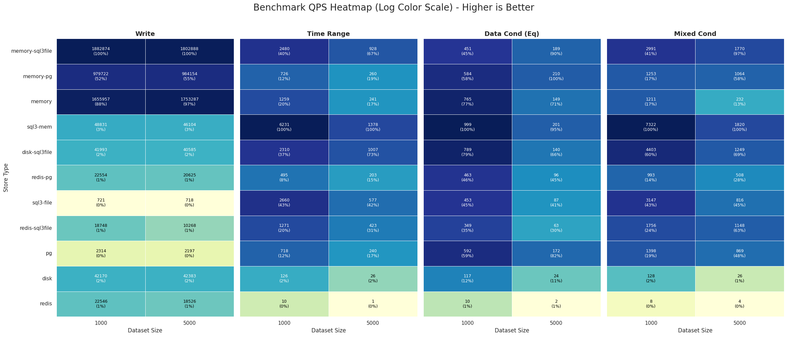

#### Meta Store

Date: 2026-01-09T06:41:59.370318

##### Details: Write

| Store Type | Total Size | Read Size | Time (ms) | QPS | vs Best |
|---|---|---|---|---|---|
| memory-sql3file | 1000 | 1000 | 0.53 | 1882873.96 | 100% (Best) |
| memory | 1000 | 1000 | 0.60 | 1655957.40 | 87.9% |
| memory-pg | 1000 | 1000 | 1.02 | 979721.84 | 52.0% |
| sql3-mem | 1000 | 1000 | 20.48 | 48830.82 | 2.6% |
| disk | 1000 | 1000 | 23.71 | 42169.75 | 2.2% |
| disk-sql3file | 1000 | 1000 | 23.81 | 41992.68 | 2.2% |
| redis-pg | 1000 | 1000 | 44.34 | 22553.75 | 1.2% |
| redis | 1000 | 1000 | 44.35 | 22546.00 | 1.2% |
| redis-sql3file | 1000 | 1000 | 53.34 | 18747.77 | 1.0% |
| pg | 1000 | 1000 | 432.18 | 2313.86 | 0.1% |
| sql3-file | 1000 | 1000 | 1386.15 | 721.42 | 0.0% |
| memory-sql3file | 5000 | 5000 | 2.77 | 1802887.94 | 100% (Best) |
| memory | 5000 | 5000 | 2.85 | 1753287.47 | 97.2% |
| memory-pg | 5000 | 5000 | 5.08 | 984153.90 | 54.6% |
| sql3-mem | 5000 | 5000 | 108.45 | 46103.59 | 2.6% |
| disk | 5000 | 5000 | 117.97 | 42382.51 | 2.4% |
| disk-sql3file | 5000 | 5000 | 123.20 | 40585.08 | 2.3% |
| redis-pg | 5000 | 5000 | 242.43 | 20624.52 | 1.1% |
| redis | 5000 | 5000 | 269.89 | 18525.81 | 1.0% |
| redis-sql3file | 5000 | 5000 | 486.94 | 10268.28 | 0.6% |
| pg | 5000 | 5000 | 2275.73 | 2197.10 | 0.1% |
| sql3-file | 5000 | 5000 | 6959.35 | 718.46 | 0.0% |

##### Details: Time Range

| Store Type | Total Size | Read Size | Time (ms) | QPS | vs Best |
|---|---|---|---|---|---|
| sql3-mem | 1000 | 100 | 0.16 | 6230.80 | 100% (Best) |
| sql3-file | 1000 | 100 | 0.38 | 2660.28 | 42.7% |
| memory-sql3file | 1000 | 100 | 0.40 | 2479.59 | 39.8% |
| disk-sql3file | 1000 | 100 | 0.43 | 2310.23 | 37.1% |
| redis-sql3file | 1000 | 100 | 0.79 | 1270.74 | 20.4% |
| memory | 1000 | 100 | 0.79 | 1259.48 | 20.2% |
| memory-pg | 1000 | 100 | 1.38 | 725.98 | 11.7% |
| pg | 1000 | 100 | 1.39 | 717.90 | 11.5% |
| redis-pg | 1000 | 100 | 2.02 | 495.05 | 7.9% |
| disk | 1000 | 100 | 7.96 | 125.67 | 2.0% |
| redis | 1000 | 100 | 101.50 | 9.85 | 0.2% |
| sql3-mem | 5000 | 500 | 0.73 | 1377.73 | 100% (Best) |
| disk-sql3file | 5000 | 500 | 0.99 | 1007.35 | 73.1% |
| memory-sql3file | 5000 | 500 | 1.08 | 927.56 | 67.3% |
| sql3-file | 5000 | 500 | 1.73 | 576.90 | 41.9% |
| redis-sql3file | 5000 | 500 | 2.37 | 422.69 | 30.7% |
| memory-pg | 5000 | 500 | 3.84 | 260.20 | 18.9% |
| memory | 5000 | 500 | 4.16 | 240.64 | 17.5% |
| pg | 5000 | 500 | 4.16 | 240.19 | 17.4% |
| redis-pg | 5000 | 500 | 4.93 | 202.68 | 14.7% |
| disk | 5000 | 500 | 38.69 | 25.85 | 1.9% |
| redis | 5000 | 500 | 667.50 | 1.50 | 0.1% |

##### Details: Data Cond (Eq)

| Store Type | Total Size | Read Size | Time (ms) | QPS | vs Best |
|---|---|---|---|---|---|
| sql3-mem | 1000 | 100 | 1.00 | 999.30 | 100% (Best) |
| disk-sql3file | 1000 | 100 | 1.27 | 789.38 | 79.0% |
| memory | 1000 | 100 | 1.31 | 765.01 | 76.6% |
| pg | 1000 | 100 | 1.69 | 592.30 | 59.3% |
| memory-pg | 1000 | 100 | 1.71 | 583.92 | 58.4% |
| redis-pg | 1000 | 100 | 2.16 | 463.39 | 46.4% |
| sql3-file | 1000 | 100 | 2.21 | 452.87 | 45.3% |
| memory-sql3file | 1000 | 100 | 2.22 | 450.99 | 45.1% |
| redis-sql3file | 1000 | 100 | 2.87 | 348.76 | 34.9% |
| disk | 1000 | 100 | 8.53 | 117.26 | 11.7% |
| redis | 1000 | 100 | 104.39 | 9.58 | 1.0% |
| memory-pg | 5000 | 500 | 4.76 | 210.12 | 100% (Best) |
| sql3-mem | 5000 | 500 | 4.98 | 200.65 | 95.5% |
| memory-sql3file | 5000 | 500 | 5.30 | 188.69 | 89.8% |
| pg | 5000 | 500 | 5.83 | 171.57 | 81.7% |
| memory | 5000 | 500 | 6.72 | 148.75 | 70.8% |
| disk-sql3file | 5000 | 500 | 7.16 | 139.71 | 66.5% |
| redis-pg | 5000 | 500 | 10.46 | 95.56 | 45.5% |
| sql3-file | 5000 | 500 | 11.49 | 86.99 | 41.4% |
| redis-sql3file | 5000 | 500 | 15.80 | 63.28 | 30.1% |
| disk | 5000 | 500 | 41.55 | 24.07 | 11.5% |
| redis | 5000 | 500 | 579.03 | 1.73 | 0.8% |

##### Details: Mixed Cond

| Store Type | Total Size | Read Size | Time (ms) | QPS | vs Best |
|---|---|---|---|---|---|
| sql3-mem | 1000 | 10 | 0.14 | 7321.87 | 100% (Best) |
| disk-sql3file | 1000 | 10 | 0.23 | 4402.78 | 60.1% |
| sql3-file | 1000 | 10 | 0.32 | 3146.93 | 43.0% |
| memory-sql3file | 1000 | 10 | 0.33 | 2990.96 | 40.8% |
| redis-sql3file | 1000 | 10 | 0.57 | 1756.00 | 24.0% |
| pg | 1000 | 10 | 0.72 | 1398.13 | 19.1% |
| memory-pg | 1000 | 10 | 0.80 | 1253.36 | 17.1% |
| memory | 1000 | 10 | 0.83 | 1211.34 | 16.5% |
| redis-pg | 1000 | 10 | 1.01 | 992.87 | 13.6% |
| disk | 1000 | 10 | 7.83 | 127.73 | 1.7% |
| redis | 1000 | 10 | 128.01 | 7.81 | 0.1% |
| sql3-mem | 5000 | 50 | 0.55 | 1819.61 | 100% (Best) |
| memory-sql3file | 5000 | 50 | 0.56 | 1770.26 | 97.3% |
| disk-sql3file | 5000 | 50 | 0.80 | 1248.68 | 68.6% |
| redis-sql3file | 5000 | 50 | 0.87 | 1147.81 | 63.1% |
| memory-pg | 5000 | 50 | 0.94 | 1063.92 | 58.5% |
| pg | 5000 | 50 | 1.15 | 868.74 | 47.7% |
| sql3-file | 5000 | 50 | 1.23 | 815.82 | 44.8% |
| redis-pg | 5000 | 50 | 1.97 | 508.12 | 27.9% |
| memory | 5000 | 50 | 4.31 | 232.02 | 12.8% |
| disk | 5000 | 50 | 38.14 | 26.22 | 1.4% |
| redis | 5000 | 50 | 231.01 | 4.33 | 0.2% |

