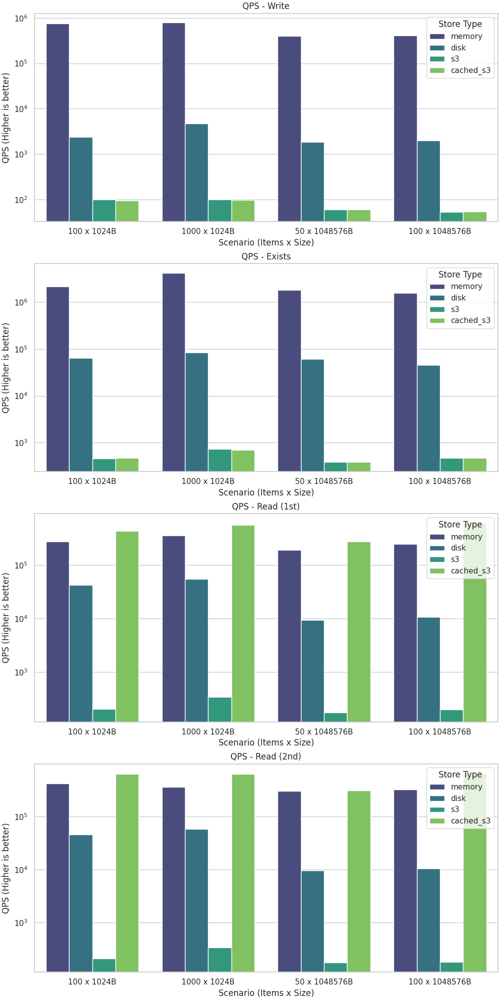

#### Resource Store

Date: 2026-01-09T06:41:20.134798

##### Details: Write

| Store Type | Scenario | Count | Size | Time (ms) | QPS |
|---|---|---|---|---|---|
| memory | 1000 x 1024B | 1000 | 1024 | 1.28 | 781539.46 |
| memory | 100 x 1024B | 100 | 1024 | 0.13 | 748941.06 |
| disk | 1000 x 1024B | 1000 | 1024 | 210.55 | 4749.49 |
| disk | 100 x 1024B | 100 | 1024 | 42.19 | 2369.97 |
| s3 | 100 x 1024B | 100 | 1024 | 996.45 | 100.36 |
| s3 | 1000 x 1024B | 1000 | 1024 | 9990.61 | 100.09 |
| cached_s3 | 1000 x 1024B | 1000 | 1024 | 10166.19 | 98.37 |
| cached_s3 | 100 x 1024B | 100 | 1024 | 1048.38 | 95.39 |
| memory | 100 x 1048576B | 100 | 1048576 | 0.24 | 410105.31 |
| memory | 50 x 1048576B | 50 | 1048576 | 0.12 | 402595.31 |
| disk | 100 x 1048576B | 100 | 1048576 | 50.24 | 1990.63 |
| disk | 50 x 1048576B | 50 | 1048576 | 27.11 | 1844.30 |
| cached_s3 | 50 x 1048576B | 50 | 1048576 | 821.91 | 60.83 |
| s3 | 50 x 1048576B | 50 | 1048576 | 829.08 | 60.31 |
| cached_s3 | 100 x 1048576B | 100 | 1048576 | 1828.76 | 54.68 |
| s3 | 100 x 1048576B | 100 | 1048576 | 1877.59 | 53.26 |

##### Details: Exists

| Store Type | Scenario | Count | Size | Time (ms) | QPS |
|---|---|---|---|---|---|
| memory | 1000 x 1024B | 1000 | 1024 | 0.24 | 4165745.86 |
| memory | 100 x 1024B | 100 | 1024 | 0.05 | 2150171.36 |
| disk | 1000 x 1024B | 1000 | 1024 | 12.05 | 82965.84 |
| disk | 100 x 1024B | 100 | 1024 | 1.56 | 64156.27 |
| s3 | 1000 x 1024B | 1000 | 1024 | 1364.05 | 733.11 |
| cached_s3 | 1000 x 1024B | 1000 | 1024 | 1436.60 | 696.09 |
| cached_s3 | 100 x 1024B | 100 | 1024 | 212.43 | 470.74 |
| s3 | 100 x 1024B | 100 | 1024 | 214.46 | 466.29 |
| memory | 50 x 1048576B | 50 | 1048576 | 0.03 | 1795194.65 |
| memory | 100 x 1048576B | 100 | 1048576 | 0.06 | 1544352.30 |
| disk | 50 x 1048576B | 50 | 1048576 | 0.82 | 60923.63 |
| disk | 100 x 1048576B | 100 | 1048576 | 2.18 | 45891.45 |
| s3 | 100 x 1048576B | 100 | 1048576 | 209.97 | 476.25 |
| cached_s3 | 100 x 1048576B | 100 | 1048576 | 213.09 | 469.28 |
| s3 | 50 x 1048576B | 50 | 1048576 | 129.21 | 386.96 |
| cached_s3 | 50 x 1048576B | 50 | 1048576 | 129.86 | 385.03 |

##### Details: Read (1st)

| Store Type | Scenario | Count | Size | Time (ms) | QPS |
|---|---|---|---|---|---|
| cached_s3 | 1000 x 1024B | 1000 | 1024 | 1.76 | 568643.59 |
| cached_s3 | 100 x 1024B | 100 | 1024 | 0.23 | 438671.10 |
| memory | 1000 x 1024B | 1000 | 1024 | 2.80 | 357538.47 |
| memory | 100 x 1024B | 100 | 1024 | 0.36 | 279442.70 |
| disk | 1000 x 1024B | 1000 | 1024 | 18.36 | 54462.38 |
| disk | 100 x 1024B | 100 | 1024 | 2.36 | 42323.89 |
| s3 | 1000 x 1024B | 1000 | 1024 | 2934.11 | 340.82 |
| s3 | 100 x 1024B | 100 | 1024 | 491.59 | 203.42 |
| cached_s3 | 100 x 1048576B | 100 | 1048576 | 0.16 | 610205.40 |
| cached_s3 | 50 x 1048576B | 50 | 1048576 | 0.18 | 277484.93 |
| memory | 100 x 1048576B | 100 | 1048576 | 0.40 | 250668.69 |
| memory | 50 x 1048576B | 50 | 1048576 | 0.26 | 190646.80 |
| disk | 100 x 1048576B | 100 | 1048576 | 9.41 | 10629.70 |
| disk | 50 x 1048576B | 50 | 1048576 | 5.30 | 9434.32 |
| s3 | 100 x 1048576B | 100 | 1048576 | 497.05 | 201.19 |
| s3 | 50 x 1048576B | 50 | 1048576 | 284.27 | 175.89 |

##### Details: Read (2nd)

| Store Type | Scenario | Count | Size | Time (ms) | QPS |
|---|---|---|---|---|---|
| cached_s3 | 100 x 1024B | 100 | 1024 | 0.16 | 637975.71 |
| cached_s3 | 1000 x 1024B | 1000 | 1024 | 1.57 | 634954.94 |
| memory | 100 x 1024B | 100 | 1024 | 0.24 | 419215.06 |
| memory | 1000 x 1024B | 1000 | 1024 | 2.79 | 358452.64 |
| disk | 1000 x 1024B | 1000 | 1024 | 17.12 | 58408.37 |
| disk | 100 x 1024B | 100 | 1024 | 2.17 | 45983.00 |
| s3 | 1000 x 1024B | 1000 | 1024 | 2932.90 | 340.96 |
| s3 | 100 x 1024B | 100 | 1024 | 469.74 | 212.88 |
| cached_s3 | 100 x 1048576B | 100 | 1048576 | 0.15 | 651125.54 |
| memory | 100 x 1048576B | 100 | 1048576 | 0.31 | 320030.35 |
| cached_s3 | 50 x 1048576B | 50 | 1048576 | 0.16 | 307093.10 |
| memory | 50 x 1048576B | 50 | 1048576 | 0.17 | 299625.75 |
| disk | 100 x 1048576B | 100 | 1048576 | 9.52 | 10508.32 |
| disk | 50 x 1048576B | 50 | 1048576 | 5.17 | 9666.08 |
| s3 | 100 x 1048576B | 100 | 1048576 | 550.63 | 181.61 |
| s3 | 50 x 1048576B | 50 | 1048576 | 281.76 | 177.46 |
